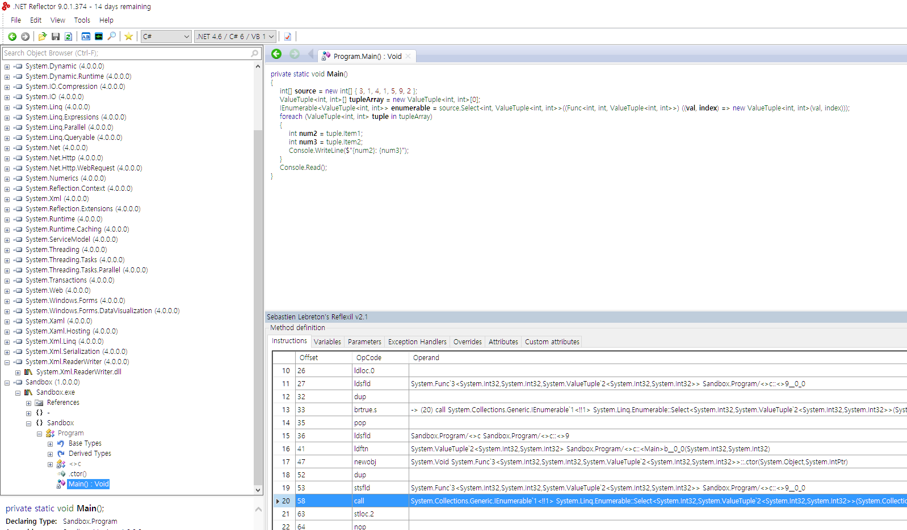
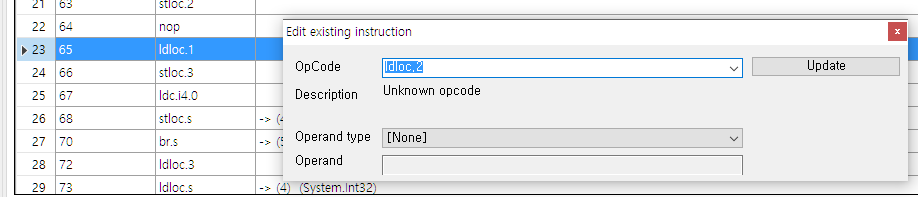
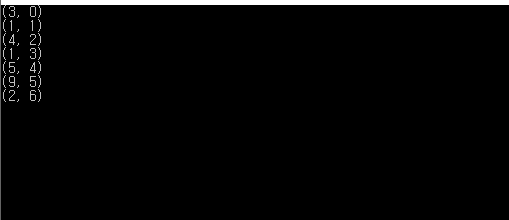

> 이 포스트에 있는 코드들은 VS2017 .Net Framework 4.7 에서 테스트 되었습니다

## 문제의 시작

간단한 정수 배열에 대해, foreach 문을 사용하여 배열의 모든 원소를 출력할 때는 보통 다음과 같은 코드를 사용한다.

```csharp
int[] list = { 3, 1, 4, 1, 5, 9, 2 };
foreach (var i in list)
{
    Console.WriteLine(i);
}
```

그렇다면 원소를 원소의 인덱스와 함께 출력할 때는? 보통은 다음과 같이 for문을 사용하거나

```csharp
int[] list = { 3, 1, 4, 1, 5, 9, 2 };
for (int i = 0; i < list.Length; i++)
{
    Console.WriteLine($"{i}: {list[i]}");
}
```

다음과 같이 인덱스에 사용될 변수를 따로 만들어 준다.

```csharp
int[] list = { 3, 1, 4, 1, 5, 9, 2 };
var index = 0;
foreach (var i in list)
{
    Console.WriteLine($"{index++}: {i}");
}
```

다음처럼 C#의 LINQ와 익명 형식을 사용하여 할 수도 있다.

```csharp
int[] list = { 3, 1, 4, 1, 5, 9, 2 };
foreach (var item in list.Select((val, index) => new { val, index }))
{
    Console.WriteLine($"{item.index}: {item.val}");
}
```

이 때 문득 든 생각인데, C# 7.0에 나온 튜플을 사용하여 문제를 해결할 수 있지 않을까? 이다.

우선 C#의 튜플에 대한 간단한 이해가 필요하다.
튜플과 패턴매칭이 사용된 간단한 예제를 통해 알아보자.

```csharp
(int, string)[] list = { (1, "a"), (2, "b"), (3, "c") };
foreach(var (i, s) in list)
{
    Console.WriteLine($"{i}: {s}");
}
```

예상한 대로 각 줄마다 1: a 2: b 3:c 를 출력한다.
여기서 list의 타입은 ``System.ValueTuple`2[System.Int32,System.String][]`` 이다. 이는 에디터에서 `(int, string)[]` 으로 표시된다. list는 배열이고, 배열 클래스는 IEnumerable 클래스를 상속하기 때문에 foreach 구문에서 사용되어질 수 있는 것이다.

그렇다면 이를 이용해 원래의 문제를 해결해 보자.
나는 다음과 같이 코드를 작성했다.


```csharp
int[] list = { 3, 1, 4, 1, 5, 9, 2 };
foreach (var item in list.Select((val, index) => (Val:val, Index:index)))
{
    Console.WriteLine($"{item.Index}: {item.Val}");
}
```

이렇게 해서 튜플을 사용하여도 문제를 해결할 수 있다. 그런데 이렇게 되면 익명 타입과 다른 게 없잖아? 라고 생각되서 패턴 매칭을 통해 인덱스와 값을 언패킹하자 생각을 하여 다음과 같은 코드를 작성했다.

```csharp
int[] list = { 3, 1, 4, 1, 5, 9, 2 };
foreach (var (v, i) in list.Select((val, index) => (val, index)))
{
    Console.WriteLine($"{i}: {v}");
}
```

겉보기에도 전혀 이상이 없고, 에디터에서 컴파일 오류도 뜨지 않았다. 그런데 이상하게도 빌드를 하려 하면 컴파일러가 어떠한 오류 메시지도 없이 빌드 실패만 내뱉는 것이다. 엥???

## 문제 분석

우선 어딘가에 오류가 있는 것은 틀림 없으니 코드를 분리해가며 어디에 오류가 있는지 알아보려고 했다.
먼저 문제가 되는 부분이라고 추측되는 `list.Select..` 부분을 변수로 분리했다.

```csharp
int[] list = { 3, 1, 4, 1, 5, 9, 2 };
var filtered = list.Select((val, index) => (val, index));
foreach (var (v, i) in filtered)
{
    Console.WriteLine($"{i}: {v}");
}
```

여전히 빌드는 되지 않는다. 평소 같았으면 여기서 포기했을 텐데 나는 발견해 버린 것이다....

```csharp
int[] list = { 3, 1, 4, 1, 5, 9, 2 };
var filtered = list.Select((val, index) => (val, index));
foreach (var i in list)
{
    Console.WriteLine(i);
}
```

filtered을 그대로 선언은 하지만 사용하지 않는 이 코드는 정상적으로 컴파일이 되고 작동도 잘 된다.
당황스러워서 나는 filtered의 타입을 확인했다. 
에디터에서는 `IEnumerable<(int val, int index)>`로 표시되었다. 
혹시 LINQ에 문제가 있진 않을까? 하는 마음에 다음 코드를 실행해 보았다.

```csharp
int[] list = { 3, 1, 4, 1, 5, 9, 2 };
var filtered = list.Select((val, index) => (val, index)).ToArray();
foreach (var (i, v) in filtered)
{
    Console.WriteLine($"{i}: {v}");
}
```

아니다.. 여전히 되질 않는다.

그래서 나는 생각의 방향을 약간 바꿔, 컴파일 타임에서 에러가 난더라고 해도 문제가 없는 코드인데 런타임에서는 에러가 안나질 않을까? 하는 생각을 했다.

정상적으로 컴파일된 프로그램을 디스어셈블리하여 코드를 수정해서 돌아갈 수 있는 코드인지 확인해보기로 했다.

## 삽질의 시작

우선 다음과 같이 빌드가 되는 코드를 작성하여 빌드하였다.

```csharp
int[] list = { 3, 1, 4, 1, 5, 9, 2 };
(int, int)[] dummy = { };
var filtered = list.Select((val, index) => (val, index));
foreach (var (i, v) in dummy)
{
    Console.WriteLine($"{i}: {v}");
}
```

당연히 아무 출력을 하지 않고 프로그램이 종료된다. 이제 이 컴파일된 어셈블리를 디스어셈블리 툴을 사용하여 분석해보자.

JetBrain의 dotPeek, Red Gate의 .Net Reflector와 IL 코드를 수정할 수 있게 해주는 확장 툴 Reflexil을 사용하였다.



foreach 문의 dummy (.Net Reflector에서는 tupleArray라고 나와있는) 부분을 원래 목적이었던 filtered (.Net Reflector에서는 enemerable라고 나와있는) 로 바꿔채야 한다.

우선 IL 코드 중 변수가 선언되는 부분은 다음과 같다.
```IL
 IL_0013: ldc.i4.0     
    IL_0014: newarr       valuetype [mscorlib]System.ValueTuple`2<int32, int32>
    IL_0019: stloc.1      // dummy

    // [15 13 - 15 70]
    IL_001a: ldloc.0      // list
    IL_001b: ldsfld       class [mscorlib]System.Func`3<int32, int32, valuetype [mscorlib]System.ValueTuple`2<int32, int32>> Sandbox.Program/'<>c'::'<>9__0_0'
    IL_0020: dup          
    IL_0021: brtrue.s     IL_003a
    IL_0023: pop          
    IL_0024: ldsfld       class Sandbox.Program/'<>c' Sandbox.Program/'<>c'::'<>9'
    IL_0029: ldftn        instance valuetype [mscorlib]System.ValueTuple`2<int32, int32> Sandbox.Program/'<>c'::'<Main>b__0_0'(int32, int32)
    IL_002f: newobj       instance void class [mscorlib]System.Func`3<int32, int32, valuetype [mscorlib]System.ValueTuple`2<int32, int32>>::.ctor(object, native int)
    IL_0034: dup          
    IL_0035: stsfld       class [mscorlib]System.Func`3<int32, int32, valuetype [mscorlib]System.ValueTuple`2<int32, int32>> Sandbox.Program/'<>c'::'<>9__0_0'
    IL_003a: call         class [mscorlib]System.Collections.Generic.IEnumerable`1<!!1/*valuetype [mscorlib]System.ValueTuple`2<int32, int32>*/> [System.Core]System.Linq.Enumerable::Select<int32, valuetype [mscorlib]System.ValueTuple`2<int32, int32>>(class [mscorlib]System.Collections.Generic.IEnumerable`1<!!0/*int32*/>, class [mscorlib]System.Func`3<!!0/*int32*/, int32, !!1/*valuetype [mscorlib]System.ValueTuple`2<int32, int32>*/>)
    IL_003f: stloc.2      // filtered
```

여기서 알 수 있는 것은 변수 list는 스택의 0번째에, dummy는 스택의 1번째에, filtered는 스택의 2번째에 선언되었다는 것이다.

그리고 IL 코드 중 루프가 시작되는 부분은 다음과 같다.

```IL
// [16 36 - 16 41]
    // [16 36 - 16 41]
    IL_0041: ldloc.1      // dummy
    IL_0042: stloc.3      // V_3
    IL_0043: ldc.i4.0     
    IL_0044: stloc.s      V_4

    IL_0046: br.s         IL_008a
    // start of loop, entry point: IL_008a

      // [16 22 - 16 32]
      IL_0048: ldloc.3      // V_3
      IL_0049: ldloc.s      V_4
```

3번째 줄의 `IL_0041: ldloc.1` 이 바로 dummy 변수가 들어가는 부분이다. 이를 filtered 로 바꾸려면 이를 `ldloc.2`로 바꾸기만 하면 끝이다.



그렇다면 남은 일은 저장하고, 확인해보는 것이다.
프로그램을 실행해본 결과 아무 결과값도 출력하지 않고 종료된다. 에러가 뜨지도 않는다. 무엇이 잘못되었던 걸까?

저장한 프로그램을 다시 디스어셈블리하면 그 이유를 알 수 있다.


다름아닌 `IEnumerable<(int, int)>`타입인 enumerable이 `(int, int)[]` 형식으로 강제 캐스팅되던 것이다. `dummy`의 타입을 바꿔서 테스트해보자.

그리하여 다시 작성한 코드이다.

```csharp
int[] list = { 3, 1, 4, 1, 5, 9, 2 };
IEnumerable<(int, int)> dummy = new(int, int)[] { (1, 1) }.AsEnumerable();
var filtered = list.Select((val, index) => (val, index));
foreach (var (i, v) in dummy)
{
    Console.WriteLine($"({i}, {v})");
}
```

위의 작업을 반복한다. 그리고 프로그램을 실행한다.



이로써 런타임에서 처음 빌드가 되질 않았던 코드는 에러 없이 잘 작동함을 확인했다. 그말은 즉, 이는 C# 컴파일러 Roslyn의 문제라는 것이 확실해졌음을 의미한다.

그래서 Roslyn의 깃헙 리포에 들어가 이슈를 검색해봤지만 이 버그에 관한 이슈는 없길래 이슈를 보고할 생각이다! 이에 관한 내용은 다음에 추가하도록 하겠다.

## 뒷이야기

이 글을 작성한지는 1년 가까이 됐지만 갑자기 생각나서 덧붙여본다.

[이슈를 올렸다.](https://github.com/dotnet/roslyn/issues/21656)

아직 정식 릴리즈되지 않았던 VS 버전에서 패치가 되었다는 이야기였다.
역시 세상에 능력자는 많다

