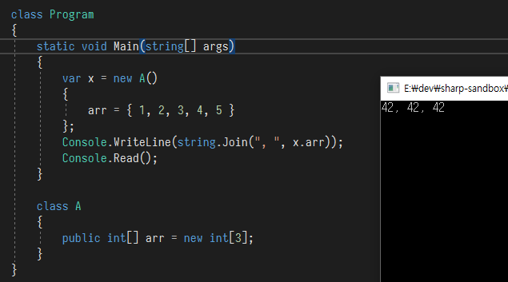

> ????!?

다음 코드의 실행 결과는 무엇일까?

```csharp
class A
{
    public int[] arr;
    
    static void Main()
    {
        var x = new A() {
            arr = { 1, 2, 3, 4, 5 }
        };
        Console.WriteLine(string.Join(", ", x.arr));
    }
}
```

내가 무엇에 대해 얘기하려고 하는지 아는 사람은 바로 결과를 말할 수 있겠지만 그렇지 않은 사람은 내가 했던 삽질을 할 것 같아서 물어본다.

그렇다면 다음의 코드를 위 코드의 맨 위에 추가한다면 실행 결과는 어떻게 바뀔까? 이 코드 안에 내가 오늘 말하고 싶은 내용이 전부 들어 있다고 봐도 무방하다.

```csharp
static class Hahahaha
{
    public static void Add(this int[] array, int elem)
    {
        Console.WriteLine(elem);
    }
}
```

첫번째 코드는 **System.Array 에는 Add 메서드가 없다** 는 에러가 발생하면서 컴파일이 되지 않는다. 두번째 코드를 추가하면 컴파일이 정상적으로 되고, 다음을 출력하고는 `NullReferenceException`이 일어난다.

```
1
2
3
4
5
```

그렇다면 첫번째 사진도 어느정도 이해가 갈 것이다.

## Collection Initializer

이를 설명하기 위해서는 C#의 [개체 및 콜렉션 이니셜라이저](https://docs.microsoft.com/ko-kr/dotnet/csharp/programming-guide/classes-and-structs/object-and-collection-initializers)에 대해서 알아야 한다.

클래스 A를 생성하고 멤버 변수를 일일히 초기화할 때 개체 이니셜라이저를 사용해 다음과 같은 코드를 편하게 만들 수 있다.

```csharp
// Before
var x = new A();
x.foo = 1;
x.bar = 2;
x.baz = 3;

// After
var x = new A() { 
    foo = 1,
    bar = 2,
    baz = 3
};
```

마찬가지로 컬렉션을 초기화할 때도 컬렉션 이니셜라이저를 사용할 수 있다.

```csharp
var students = new Dictionary<int, string>()
{
    { 1, "foo" },
    { 2, "bar" },
    { 3, "baz" }
};

var numbers = new List<int>()
{
    1, 2, 3, 42
};
```

그리고, 당연히 이는 C#의 신태틱 슈거이다. (당연하지는 않나?)
실제로 이는 다음과 같이 작동한다.

```csharp
var students = new Dictionary<int, string>();
students.Add(1, "foo");
students.Add(2, "bar");
students.Add(3, "baz");

var numbers = new List<int>();
numbers.Add(1);
numbers.Add(2);
numbers.Add(3);
numbers.Add(42);
```

왜 이렇게 작동하냐고 물어보시면, 먼저 C#의 스펙에 다음과 같이 나와있다.

```
C# Language Specification - 7.5.10.3 Collection Initializers
The collection object to which a collection initializer is applied must be of a type that implements  System.Collections.IEnumerable or a compile-time error occurs. For each specified element in order, the collection initializer invokes an Add method on the target object with the expression list of the element initializer as argument list, applying normal overload resolution for each invocation. Thus, the collection object must contain an applicable Add method for each element initializer.
```

이것으로도 충분하지만, 컴파일해서 확인해보면 코드가 저렇게 바뀜이 분명하게 보인다.

```IL
IL_002e: newobj       instance void class [mscorlib]System.Collections.Generic.List`1<int32>::.ctor()
IL_0033: dup          
IL_0034: ldc.i4.1     
IL_0035: callvirt     instance void class [mscorlib]System.Collections.Generic.List`1<int32>::Add(!0/*int32*/)
IL_003a: nop          
IL_003b: dup          
IL_003c: ldc.i4.2     
IL_003d: callvirt     instance void class [mscorlib]System.Collections.Generic.List`1<int32>::Add(!0/*int32*/)
IL_0042: nop          
IL_0043: dup          
IL_0044: ldc.i4.3     
IL_0045: callvirt     instance void class [mscorlib]System.Collections.Generic.List`1<int32>::Add(!0/*int32*/)
IL_004a: nop          
IL_004b: dup          
IL_004c: ldc.i4.s     42 // 0x2a
IL_004e: callvirt     instance void class [mscorlib]System.Collections.Generic.List`1<int32>::Add(!0/*int32*/)
IL_0053: nop          
IL_0054: stloc.1      // numbers
```

즉 처음의 문제냈던 코드는 다음과 같이 변환이 된다.

```csharp
class A
{
    public int[] arr;
    
    static void Main()
    {
        var x = new A();
        x.arr.Add(1);
        x.arr.Add(2);
        x.arr.Add(3);
        x.arr.Add(4);
        x.arr.Add(5);
        Console.WriteLine(string.Join(", ", x.arr));
    }
}
```

이때 `x.arr`의 타입인 배열은 `Add` 메서드가 존재하지 않으므로 컴파일 에러가 발생한다. 하지만 C# 6.0이 업데이트 되면서 [확장메서드 `Add`도 컬렉션 이니셜라이저에서 사용할 수 있게 되면서](https://github.com/dotnet/roslyn/wiki/New-Language-Features-in-C%23-6#extension-add-methods-in-collection-initializers) `int[]` 타입에 `Add` 메서드를 확장메서드로 추가해주면 컴파일은 되지만, x.arr 는 아직 생성이 되지 않았으므로 `NullReferenceException`이 발생하는 것이다.

그래서 클래스 `A`의 `arr`을 생성자 혹은 그 이전에 초기화를 해주면 어떻게든 되긴 한다. 물론 처음에 보여줬던 흑마법도 가능하다. 첫번재 사진에서 보여줬던 흑마법은 다음의 코드로 볼 수 있다.

```csharp
class Program
{
    static void Main(string[] args)
    {
        var x = new A()
        {
            arr = { 1, 2, 3, 4, 5 }
        };
        Console.WriteLine(string.Join(", ", x.arr));
        Console.Read();
    }

    class A
    {
        public int[] arr = new int[3];
    }
}

static class Extension
{
    public static void Add(this int[] array, int element)
    {
        array[0] = array[1] = array[2] = 42;
    }
}
```

물론 원래 이렇게 쓰라고 있는 기능은 아니다. 제발 이렇게 쓰지 말자. 뺨맞는다.

## 응용

다음과 같이 쌈빡하게 행렬을 초기화할 수 있다.

```csharp
static void Main()
{
    var m = new Matrix()
    {
        { 1, 0, 0, 0 },
        { 0, 1, 0, 1 },
        { 0, 0, 1, 0 },
        { 0, 0, 0, 1 }
    };
}

class Matrix : IEnumerable<float>
{
    public void Add(params float[] oh)
    {
        // Do somethine here..
    }

    IEnumerator<float> IEnumerable<float>.GetEnumerator()
        => throw new NotImplementedException();
    
    IEnumerator IEnumerable.GetEnumerator()
        => throw new NotImplementedException();
}
```

그럼 마지막으로 클래스 `Matrix`의 `Add` 메서드에서 파라미터를 받을 때 `params` 키워드를 사용하지 않으면 어떻게 되는지 직접 생각해보고 결과를 보자. 댓글로 달든 말든 상관은 없다. 하지만 달아 주면 재밌을 거 같은데

## TMI

새벽에 이거 가지고 많이 고생하고 이해가 안가서 [stackoverflow에 질문](https://stackoverflow.com/questions/48466205/cant-understand-why-array-initializer-in-object-initializer-cannot-compiled/48466344#48466344)도 올렸었다...