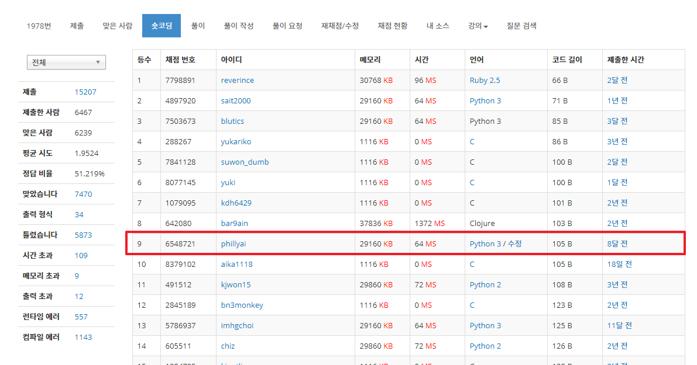

백준 온라인 저지에는 [소수 찾기](https://www.acmicpc.net/problem/1978)라는 문제가 있다. 100개 이하의 수들이 주어지고, 이들은 1000보다 작을 때 이들 중 소수들의 개수를 출력하는 프로그램을 작성하는 문제이다.

백준 온라인 저지같은 알고리즘 해결 문제 사이트는 문제를 빠르게, 효율적으로 문제를 푸는 것이 목표인 모범생(?)들이 있는가 하면, 어떻게든 더 짧은 코드를 작성하려 하는 숏코딩을 좋아하는 변태들도 있다. 그리고 나도 그런 듯 하다.



> 일부러 짧게 작성한 코드도 아니었는데 저렇게 된걸 이제야서 봐서 신기했음

참고로 내 코드는

```python
input()
print(len([p for p in map(int, input().split()) if p != 1 and all(p % i for i in range(2, p))]))
```

## 페르마의 소정리

그런데 2위의 [sait2000님의 71B로 작성된 파이썬3 코드](https://www.acmicpc.net/source/4897920)는 왜 저렇게 짧은가 해서 봤더니 다음과 같다.

```python
input();print(sum(10103**~-A%A<2<=A for A in map(int,input().split())))
```

이는 [페르마의 소정리](https://ko.wikipedia.org/wiki/%ED%8E%98%EB%A5%B4%EB%A7%88%EC%9D%98_%EC%86%8C%EC%A0%95%EB%A6%AC)를 이용함으로 보인다. 페르마의 소정리는 소수 p 에 대해서 `a ** (p-1) % p = 1`이 카마이클 수와 0이 아닌 정수 a에 대해서 성립한다는 정리이지만, 이는 어디까지나 충분조건으로써 소수가 아닌 합성수에 대해서 결과값이 꼭 1이 아닌 값이 나오지 않는다.
그래서 저 풀이법은 테스트 케이스가 1000 이하의 수들만 사용함으로써 그 수들에만 적당히 잘 통과하는 마법의 수 a를 찾아서 사용함으로 보인다. 그래서 나도 직접 해봤다.

```python
def primes(n):
    sieve = [True] * n
    for i in range(3,int(n**0.5)+1,2):
        if sieve[i]:
            sieve[i*i::2*i]=[False]*((n-i*i-1)//(2*i)+1)
    return [2] + [i for i in range(3,n,2) if sieve[i]]

p = primes(20000)
ps = [n for n in p if n > 1000]
notps = [n for n in range(2, 1000) if not n in p]

for prime in ps:
    for notp in notps:
        if prime ** ~-notp % notp == 1:
            print(prime, notp)
            break
    else:
        print(prime)
        break
else:
    print('no..')
```

별 거 없는 코드이다. 1000 이하의 합성수인 자연수 `n` 에 대해 `a ** (p-1) % p != 1` 이 성립하는 소수 `p`를 적당히 20000 이하에서 찾는 코드이다. 내 생각이 맞다면, 코드에서 사용한 10103 이라는 값은 이 코드의 실행 결과값이 될것이다. 그리고 코드를 실행시켜보면... 아쉽게도 그런 값이 없다는 `no..` 밖에 출력되지 않는다.

엥? 해서 p = 10103 에 대해서 결과값이 1이 되는 a의 값들을 찾아보니 `561 645 946` 의 세 수 밖에 없었다. 아마도 테스트 케이스에는 이 세 수가 없는 걸로 보인다. 그래서 적당히 잘 피해간 것으로 보인다. ㅎㅎ..

[위 코드는 jupyter notebook으로 gist](https://gist.github.com/phillyai/1b167ca6df5c250f45e8834dc228b0d5)에 업로드 했다.


## 윌슨의 정리

좀 더 재밌는 풀이들을 찾고 싶어져서 코드골프 stackexchange에 검색을 해봤다.
[Is this number a prime?](https://codegolf.stackexchange.com/questions/57617/is-this-number-a-prime?utm_medium=organic&utm_source=google_rich_qa&utm_campaign=google_rich_qa) 이라는 제목으로 글이 있었고 다양한 언어로 작성된 해괴한 풀이들이 많았다.

그중에서 [파이썬으로 작성된 단순한 풀이](https://codegolf.stackexchange.com/a/58114)를 찾았다.

```python
P=n=1
exec"P*=n*n;n+=1;"*~-input()
print P%n
```

처음엔 정말 당황했지만 사실 별거 아닌 문제다. 변수 P 는 `(n-1)! * (n-1)!` 이 들어가고, `P % n` 값을 출력한다. 이는 [윌슨의 정리](https://ko.wikipedia.org/wiki/%EC%9C%8C%EC%8A%A8%EC%9D%98_%EC%A0%95%EB%A6%AC)를 사용한다는 것을 지인에게 물어봐서 알게 되었다. 윌슨의 정리는 소수 p에 대해서 `(p-1)! % p = -1` 이고, 이의 역도 성립하여 소수를 판별하는데 위처럼 사용할 수 있다.


## 규식이

답변 중 [detecting primes with a regex](https://stackoverflow.com/questions/2795065/how-to-determine-if-a-number-is-a-prime-with-regex) 이라는 글을 봤다. `.?|(..+?)\1+` 이라는 정규식이 글자수가 소수인 문자열은 매칭이 안된다는 것이다. 나는 한동안 이해가 안되서 애먹었지만 인터넷에는 이를 자세히 설명한 글들이 많이 있다. 내 조잡한 설명보다 다른 사람들이 더 잘 설명해주니까 [이 글](https://iluxonchik.github.io/regular-expression-check-if-number-is-prime/)과 [상태 머신으로 확인할 수 있는 사이트](https://www.debuggex.com/r/yKwWjANf5KZ4syyW)으로 확인해보면 이해가 잘된다.


## Esolang

이외에도 난해한 언어 [Hexagony](https://codegolf.stackexchange.com/a/58347)를 사용한 풀이도 정말 신기했다. 그래서 나도 한번 해보았다. 내가 개인적으로 애착이 가는 [marbelous](https://github.com/phillyai/marbelous-docs-korean) 라는 언어를 사용해서 소수를 판별하는 프로그램을 작성해보았다.

```marbelous
:prit
}0 }1 }0 }1 }0 }1 01 00
nu eq &0 &0 .. +1 &2 &3
=1 &0 md lr &1 &1 {0 {0
&2 \/ =0 &1 pr it
\/ .. &3 \/ {0
.. .. \/

# modular
:mdlr
}0 }1 00
mo du it
{0 .. ..

:moduit
.. }1 }2 
}0 Mu lt .. }2 .. 
Le ss .. }0 -1 }1
=0 &0 .. &0 &0 &0
&1 .. .. .. Mu lt
\/ .. }2 Su bt ..
}0 }1 +1 {0 .. ..
&1 &1 &1 .. .. ..
mo du it .. .. ..
{0 .. .. .. .. ..
```

전체 코드는 역시 [내 gist](https://gist.github.com/phillyai/2dc30936f71231a029f07eb3a981c052)에서 볼 수 있다.. 덧셈이나 모듈러 연산마저 없어서 직접 만들어야 했다. 너무 끔찍했지만 행복했다..

