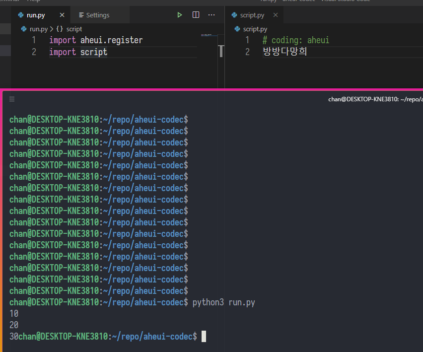

최근 굉장히 재밌는 걸 보고 삘이 꽂혀서 열심히 삽질해본 게 있다.

`script.py`
```python
# coding: aheui
방방다망희
```

`run.py`
```python
import aheui.register
import script
```



## 계기

HN에서 재밌는 포스트를 보았다. `Effortlessly write inline C functions in Python` 이라는 타이틀로 올라온 깃헙 리포는 [inlinec](https://github.com/georgek42/inlinec) 였다.

대충 다음과 같은 예제 코드가 리드미에 올라와있다.

```python
# coding: inlinec
from inlinec import inlinec

@inlinec
def Q_rsqrt(number):
    float Q_rsqrt( float number )
    {
        long i;
        float x2, y;
        const float threehalfs = 1.5F;

        x2 = number * 0.5F;
        y  = number;
        i  = * ( long * ) &y;                       // evil floating point bit level hacking
        i  = 0x5f3759df - ( i >> 1 );               // what the fuck? 
        y  = * ( float * ) &i;
        y  = y * ( threehalfs - ( x2 * y * y ) );   // 1st iteration

        return y;
    }

print(Q_rsqrt(1.234))
```

그리고 `inspired by pyxl` 라면서 비슷하게 JSX같은 신택스를 구현해놓은 [pyxl4](https://github.com/pyxl4/pyxl4)도 보았다.

```python
# coding: pyxl
print <html><body>Hello World!</body></html>

image_name = "bolton.png"
image = 

text = "Michael Bolton"
block = <div>{image}{text}</div>

element_list = [image, text]
block2 = <div>{element_list}</div>
```

이 두 프로젝트는 너무나 신세계였고 어떻게 이게 가능한지가 너무 궁금해서 찾아봤다.

## 원리

[PEP 236](https://www.python.org/dev/peps/pep-0263/)은 파이썬 소스 코드의 인코딩에 관한 proposal이다. 사이트에 올라온 예제 코드는 다음과 같은 식이다.

```python
#!/usr/bin/python
# coding: latin-1
import ...
```

이런식으로 소스 코드의 인코딩의 맨 처음에 소스 코드의 인코딩을 지정할 수 있고, 이에 맞게 에디터나 인터프리터가 소스코드를 디코딩할 수 있게 한다. 이게 이 proposal의 핵심이다.

하지만 우리가 주목할 건 따로 있다. 바로 여기서 사용되는 인코딩 (`latin-1`, `ascii`, `utf-8`) 등을 새롭게 정의하여 직접 인코딩/디코딩을 구현할 수 있다는 것


이는 파이썬의 [`codecs`](https://docs.python.org/3/library/codecs.html) 모듈덕분에 가능하다. `codecs` 모듈은 보통 스트리밍 인코더/디코더 등에 사용되지만 다음 [`codecs.register(search_function)`](https://docs.python.org/3/library/codecs.html#codecs.register) 함수에 대한 설명을 보면 `codec search function`을 등록할 수 있음으로 보인다.

이를 사용하여 이 포스트의 처음에 나오는 예제들은 `# coding: inlinec` `# coding: pyxl`등의 커스텀 인코딩을 추가해 코드를 전처리함으로 순수 코드자체를 입출력으로 하는 메타프로그래밍이 가능한 것

## 실험

바로 적용해서 볼 수 밖에 없다.

`register.py`
```python
import codecs, encodings

def search_function(encoding):
    if encoding != "aheui":
        return None
    utf8 = encodings.search_function("utf8")
    return codecs.CodecInfo(
        name="aheui",
        encode=utf8.encode,
        decode=utf8.decode,
    )

codecs.register(search_function)
```

이렇게 하면 `aheui` 라는 이름의 인코딩이 등록이 된 것이다. 모든 인코딩/디코딩은 utf8과 동일하지만 일단 새로운 이름의 인코딩을 만든게 어디야

바로 코드를 실행해서 돌려보자. 하지만 문제가 있다.
파이썬 소스 코드의 인코딩 선언은 PEP-263에 따르면 문서의 맨 위에 있어야 하고, 이전에 저 인코딩 등록 코드를 실행을 해야한다. 그래서 단독 파일로 바로 실행은 추가적인 설치를 거쳐야 하므로 적당히 타협을 하는 걸로 하자

`run.py`
```python
import register
import script
```

`script.py`
```python
# coding: aheui
print("hello world!")
```

```
$ python3 run.py
hello world!
```

문제 없이 잘 돌아간다. 여기까지는 딱히 특별할게 없다

이제 본격적으로 디코딩을 작성해보자. 여기서부터는 다른 소스코드의 도움을 많이 받았다.

우리는 새로운 `CodecInfo` 객체를 만들 때 `decode`에 새로운 값을 넣어 중간에 값을 빼돌리도록 하겠다.

저 `decode` 의 타입은 다음과 같다. (from codecs.pyi)

```python
_Decoded = Text
_Encoded = bytes

class _Decoder(Protocol):
    def __call__(self, input: _Encoded, errors: str = ...) -> Tuple[_Decoded, int]:
```

이걸 보고 대충 만들어본다면 다음처럼 하면 적당히 도는가 싶다.

`register.py`
```python
def aheui_decode(input, errors="strict"):
    raw = bytes(input).decode("utf-8")
    print(raw)
    return raw, len(input)

def search_function(encoding):
    if encoding != "aheui":
        return None
    utf8 = encodings.search_function("utf8")
    return codecs.CodecInfo(
        name="aheui",
        encode=utf8.encode,
        decode=aheui_decode,
    )

codecs.register(search_function)
```

`script.py`
```python
# coding: aheui
print("hello world!")
```

```
$ python3 run.py
# coding: aheui
print("hello world!")

hello world!
```

보다싶이 코드 전체가 출력됨을 알 수 있다. 그렇다면 물론 여기서 코드를 수정하는 것도 가능하겠지

`register.py`
```python
def aheui_decode(input, errors="strict"):
    raw = bytes(input).decode("utf-8")
    hooked = raw.replace("world", "20chan")
    return hooked, len(input)
```

```
$ python3 run.py
hello 20chan!
```

모든 준비는 끝났다. 이제 원하는 이상한 짓을 하면 된다.
하지만 여기서 주의해야할 점은, 이 코드는 어디까지나 전처리기처럼 소스코드 -> 바이트코드의 컴파일타임에서 한번 실행되며 컴파일된 코드를 실행할때는 실행되지 않는다는 점이다.

그럼 여기서 정상적인 파이선-아희 DSL을 만들려면 어떻게 해야 할까? 바로 아희코드를 통째로 파이썬 코드로 컴파일해주는 코드를 만드는 것이다.
아니면 아희 인터프리터 코드와 코드 전체를 raw string으로 때려박아 실행시키거나 상관은 없지만 이왕 할거면 간지나게 하는게 나을듯

## 결과

아직 직접 하진 않았다. 지금까지 아희 인터프리터를 세번 만들고 나니 또 컴파일러를 직접 만들자니 너무 귀찮아서 못하겠다

그래서 그냥 작동 테스트만 하려고 남이 만든 인터프리터코드를 적당히 가져와 다음과 같이 작성했다

`register.py`
```python
aheui_code = """ ... """

def aheui_decode(input, errors="strict"):
    raw = bytes(input).decode("utf-8")
    code = "\n".join(raw.splitlines()[1:])
    hooked = aheui_code + f'eval("""{code}""")'
    return hooked, len(input)
```

`script.py`
```python
# coding: aheui
밤밣따빠밣밟따뿌
빠맣파빨받밤뚜뭏
돋밬탕빠맣붏두붇
볻뫃박발뚷투뭏붖
뫃도뫃희멓뭏뭏붘
뫃봌토범더벌뿌뚜
뽑뽀멓멓더벓뻐뚠
뽀덩벐멓뻐덕더벅
```

```
$ python3 run.py
Hello, world!
```


> 진짜 되더라...

아희 인터프리터 코드는 적당한 코드를 테스트용으로 넣어서 테스트했다.

아희 인터프리터 코드를 제외한 전체 코드는 [gist](https://gist.github.com/20chan/0c2c890072067fee8475a15a6ee10c42)에 올려놨다. 아마 갈고 깎아서 깃헙에 프로젝트를 올리지 않을까 싶다.

## 추가로

이런 미친짓을 정말 굳이 해야할까 싶지만, 일단 재밌다.
그리고 pyxl은 [귀도가 직접 관리하기도 한 프로젝트](https://github.com/gvanrossum/pyxl3)이기도 했기에 그렇게 '나쁜짓'에 해당하는 흑마법까지는 아니지 않을까 싶다.

이거 해내고 빨리 자랑하고 싶어서 얼마나 입이 간질간질했는지 참
