아무리 이상하고 쓸데없는걸 많이 하는 프로그래머들에게도 '그걸 왜해' 하는 일들이 있다. 메일 서버가 그중 하나일만큼 정말 쓸데없고 귀찮다.

계기는 간단했다. 최근에 시작한 [탈구글하기](https://nomoregoogle.com/) 프로젝트에서 맘에 드는 메일 클라이언트가 없었고, 기존에 쓰는 구글 계정이나 그쪽으로 포워딩해둔 커스텀 도메인 이메일들을 쓰기 싫어져서 아예 메일 서버를 새로 만들자고 생각했던건데 사실 다 핑계고 그냥 간지나보였다.

사실상 메일 서버가 아니라 메일 서비스를 통째로 만드는 거니까 메일 서버, 메일 클라이언트가 필요했고 메일 서버가 단순히 메일을 받고 보내기만 가능한 것 뿐만 아니라 계정 보안, 스팸 필터링 등의 복잡한 부가 기능이 필요했다.

내가 실제로 사용하기 위해 원했던 최소한의 기준은 다음과 같다:
- 보안 로그인
- 상식적인 메일 송수신
- 메일 필터링과 편지함 관리
- 스팸 필터링
- 10초 이내의 메일 알림

그리고 결론적으로 IMAP과 SMTP, SIEVE, 인증서, SPF, DKIM, DMARC 등을 지원하는 보안 이메일 서비스를 만들었다.

## 준비

메일서버는 [tomav/docker-mailserver](https://github.com/tomav/docker-mailserver)와 웹 클라이언트는 [rainloop](https://github.com/RainLoop/rainloop-webmail)을 사용하기로 했다. 인증서는 letsencrypt, 리버스 프록시는 서버에 붙어있는 nginx을 그대로 쓰기로 했다. 이건 좀 후회가 많이 되는 부분임

저 메일 서버는 IMAP와 SMTP기반 메일 송수신과 파일시스템으로 계정-메일을 관리하는 방식과 스팸 필터링, 로그인 밴같은 기본적인 기능부터 dkim, ssl, spf 등의 보안 설정과 릴레이 등도 전부 도커 이미지 하나로 쉽게 돌릴 수 있어서 세상 참 좋아졌구나 느꼈다

암튼 [만든 사람의 취지](https://tvi.al/simple-mail-server-with-docker/)에도 잘 맞고 클라이언트는 무난하게 아무거나 골랐다.

메일서버를 구동할 서버는 기존 여러 도메인과 여러 마이크로 서비스를 붙여서 괴롭히고 있던 aws lightsail 인스턴스에다 올리고, 도메인은 큰그림을 그리고 샀던 도메인 하나를 사용하기로 했다. 여기에서 좀 몇가지 문제가 생겼지만 이거는 나중에 말하는걸로

메일 클라이언트 웹 호스트는 `mail.{domain}`를 사용하기로 했고, 그리고 smtp 서버도 `mail.{domain}`을 사용하기로 했다.

그리고 아티클이 정말 찾기 힘들다. 완전 같은 기술스택을 사용한는 글은 못찾았고, 대신 가장 비슷한 [docker-mailserver + rainloop + caddy에 self-cert 사용한 글](https://medium.com/minds-in-the-cloud/spin-off-an-email-server-with-containers-using-docker-compose-on-google-cloud-platform-debian-9-aa0fe8bf3d88)이 유일한 from scratch 블로그 포스트였다. 이 글과 mail-server 리포 readme와 위키를 가장 많이 참고했고, 대부분의 SMTP나 서버 문제는 정말 제대로 된 글 찾기도 힘들고 웹삽질도 많이 햇다.

## 설치

설치와 설정은 정말 정말 간단하다. 오랜만에 docker와 docker-compose 뽕을 제대로 받았다.

```shell
$ docker pull tvial/docker-mailserver
$ docker pull hardware/rainloop

$ curl -o setup.sh https://raw.githubusercontent.com/tomav/docker-mailserver/master/setup.sh
$ chmod a+x ./setup.sh
$ curl -o docker-compose.yml https://raw.githubusercontent.com/tomav/docker-mailserver/master/docker-compose.yml.dist
$ curl -o .env https://raw.githubusercontent.com/tomav/docker-mailserver/master/.env.dist
```

도커에서 이미지를 받고, 리포의 강력추천 스크립트와 설정파일도 받아준다. 가장 기본적인 설정만 하기 위해 `.env`파일을 수정하자

```env
HOSTNAME=mail
DOMAINNAME={domainname}
CONTAINER_NAME=mail
```

그리고 rainloop을 서비스로 돌리기 위해 `docker-compose.yml` 파일을 수정해준다


```yml
version: '2'
services:
  rainloop:
    container_name: rainloop
    image: hardware/rainloop:latest
    restart: always
    links:
    - mail
    ports:
    - "6001:8888"
    volumes:
    - rainloop_data:/rainloop/data
  mail:
  # ...
volumes:
# ...
```

nginx 설정도 간단하다

```nginx
server {
    server_name mail.{domain}

    location / {
        proxy_pass http://localhost:6001;
    }

    # ...letsencryptstuffs
}
```

근데 이걸 caddy 사용해서 프록시와 인증서 관리하는거 보고 caddy괜찮은데?? 하고 찾아보니 역시 다들 nginx에서 caddy로 갈아타고 그걸 자랑하더라. 나도 언젠가 그래야지

그럼 이제 아마 적어도 돌아는 가는 상황은 됐을거다 `docker-compose up`으로 전부 실행해주면 서버도 시작은 되고, 클라이언트도 시작은 된다.
하지만 중요한 DNS 설정을 아직 말 안했다 사실 이게 제일 중요함

```
mail    A   {ip}
@       MX  10 mail.{domain}
```

그리고 서버 인증서는 다른 도메인 인증하는데 썼던거처럼 letsencrypt를 그대로 쓰기로 했다.
근데 여기서 실수해서 경로를 글로벌로 잡아버려서 무시무시한 짓을 하게 되었다 아무튼

```shell
$ certbot certonly --standalone -d mail.{domain}
```

로 인증서를 발급받고, 이 글로벌 루트 경로인 `/etc/letsencrypt/` 경로를 그대로 docker에 넘겨버리기로 했다.

이제 슬슬 테스트를 해볼 시점이다. 이메일 계정으로 사용할 유저 계정을 넣자

```shell
$ sudo ./setup.sh email add {username}@mail.{domain} {password}
```

그리고 실행

```shell
$ sudo docker-compose up -d
Starting mail … done
Starting rainloop … done
```

그렇게 이메일 클라이언트 rainloop를 실행할 수 있게되었다.
그런데 여기서 바로 들어가서 위에 넣었던 유저 계정으로 로그인하면 `domain is not allowed` 에러가 뜬다. 여기서 좀 헤맸지만, 아직 rainloop 설정을 안해서 그렇다. `mail.{domain}?admin` 으로 들어가 rainloop 어드민 판넬에 로그인하자. 초기 아이디 비밀번호는 `admin` `12345` 이다.

들어가 바로 어드민 비밀번호를 수정하고, 도메인을 추가해준다.

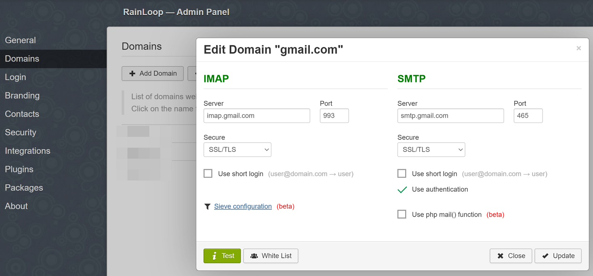

사진은 gmail이지만 아무튼 이런식으로 넣어주고 Test를 눌렀을 때 둘다 초록색으로 나오면 ok
이제 다시 추가했던 계정으로 로그인하면 로그인 성공 후 빈 메일함이 나와줘야 한다.

## 하지만

물론 여기까지 순탄하게 오질 않았다. SMTP서버가 작동하지 않아 온갖 삽질을 다 했다.

### user not found

분명 위 도메인을 추가하고 로그인을 해도 로그인이 안되서 삽질을 했는데, 다음처럼 수동으로 로그인을 해서 테스트를 해보면 분명 로그인이 됐다

```
$ sudo ./setup.sh email list
$ sudo ./setup.sh debug login

# get inside docker shell
$ doveadm auth login {email} {password}
```

그런데 여기서 로그를 보니 `doveadm`을 이용해 로그인할 때 패스워드가 틀렸을 때는 분명 유저 이름이 도메인 이름을 포함한 풀 이메일 `username@domain`으로 나오는데, rainloop 에서 로그인을 하면 `username`으로만 나오고 user not found 에러가 나더라고

그래서 보니까 rainloop admin 도메인 설정에서 `Use short login` 옵션이 켜져있었다. 이걸 꺼야 하는데 이거때문에 멍청하게 얼마나 삽질을 했는지

### Could not connect to SMTP host

smtp 연결이 잘 안되더라. 분명 제대로 설정을 한 것 같은데 포트, ssl, starttls 등 하나하나 바꿔가면서 테스트를 해보는데 계속 테스트가 실패해서

일단 기존에는 텔넷으로 이렇게 테스트를 했다. 포트는 너무 많은 포트에 너무 많은 테스트를 해서 까먹었다

```shell
$ telnet mail.{domain} {port}
```

그러면 STARTTLS 이후 `SMTP Error: Could not connect to SMTP host` 라는 에러와 함께 깨진 유니코드같은 텍스트가 나오더니 죽고, 서버에서는 이렇게 TLS 버젼 에러가 난다

```log
Jun 16 03:25:21 mail postfix/smtps/smtpd[9341]: SSL_accept error from unknown[{ip}]: -1
Jun 16 03:25:21 mail postfix/smtps/smtpd[9341]: warning: TLS library problem: error:1408F10B:SSL routines:ssl3_get_record:wrong version number:../ssl/record/ssl3_record.c:332:
Jun 16 03:25:21 mail postfix/smtps/smtpd[9341]: lost connection after CONNECT from unknown[{ip}]
```

이게 서버 문제인줄 알고 서버에서 `TLS_LEVEL`을 modern에서 intermediate로 바꿨는데 좀만 찾아보니 사실 이게 텔넷 클라이언트 문제더라고
다음처럼 openssl로 접속하면 인증까지는 잘 되더라

```shell
$ openssl s_client -crlf -connect mail.{domain}:{port}
```

이후에는 포트삽질좀 하다 위키에서 [포트 문서](https://github.com/tomav/docker-mailserver/wiki/Understanding-the-ports) 읽고 또 삽질해서 맞는 포트 전부 잘 맞춰주니까 메일 수신은 성공했다. 내부 계정 -> 내부 계정도, 지메일 -> 내부 계정도 잘 됐다.

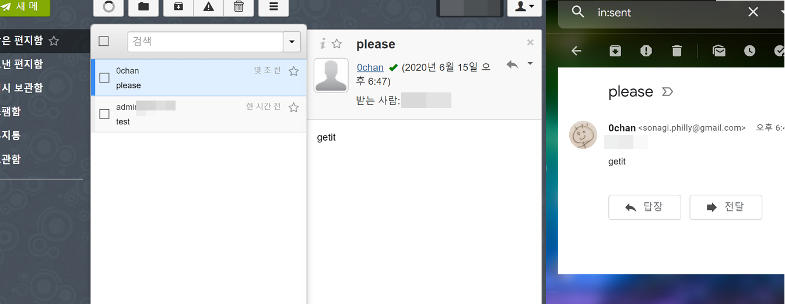

너무 기뻐서 처음 메일 왔을 때 스크린샷 찍어뒀다

## 추가

### SPF

DNS에 다음 softfail spf를 추가한다.

```DNS
@   TXT "v=spf1 mx ~all"
```

자세한건 [위키](https://github.com/tomav/docker-mailserver/wiki/Configure-SPF)

### dkim

```shell
$ sudo ./setup.sh config dkim
```

그러면 dkim 키가 `config/opendkim/keys/{domain}/mail.txt`에 생성된다. 이걸 적당히 DNS에 추가해준다. 역시 자세한건 [위키](https://github.com/tomav/docker-mailserver/wiki/Configure-DKIM)

```DNS
mail._domainkey TXT "v=DKIM1; h=sha256; k=rsa; p=...."
```

### SPAMASSASSIN

environment에서 적당히 `ENABLE_SPAMASSASSIN=1` 을 넣어주면 작동한다.

## 25

로그인, 메일 받기, 스팸 필터링 등도 다 되는데 아직 제일 중요한 메일 보내는게 안된다.
도대체 문제가 뭘까? 하루종일 로그만 들이다 보았다. 매번 같은 문제였다.

```log
Jun 16 03:19:06 mail postfix/smtp[8064]: connect to gmail-smtp-in.l.google.com[2404:6800:4008:c07::1b]:25: Cannot assign requested address
Jun 16 03:19:36 mail postfix/smtp[8064]: connect to gmail-smtp-in.l.google.com[74.125.203.27]:25: Connection timed out
Jun 16 03:19:36 mail postfix/smtp[8064]: connect to alt1.gmail-smtp-in.l.google.com[2607:f8b0:4003:c10::1b]:25: Cannot assign requested address
...
```

다른 메일 서버의 smtp에 연결하려고 하면 cannot assign requested address..이후 time out에러가 떠서 결국 외부 메일 서버로 메일이 보내지지 않는다

이 문제는 나름 흔했던 것 같다 비슷한 문제를 겪는 이슈가 [1](https://github.com/tomav/docker-mailserver/issues/1524) [2](https://github.com/tomav/docker-mailserver/issues/1490) [3](https://github.com/tomav/docker-mailserver/issues/1127) [4](https://github.com/tomav/docker-mailserver/issues/854) [5](https://github.com/tomav/docker-mailserver/issues/771) [6](https://github.com/tomav/docker-mailserver/issues/598) [7](https://github.com/tomav/docker-mailserver/issues/234) [8](https://github.com/tomav/docker-mailserver/issues/150) 이렇게나 많았다.

하지만 정말 단순하고 근본적인 문제였다. 로컬에서는 메일서버 25포트로 연결이 되는데, 인스턴스 안에서는 자기 자신으로는 물론 outbound 25포트가 전부 안됐다. 그제서야 이게 저 많은 이슈들에서 말했던 근본적으로 어쩔 수 없는 문제라는 말이 이해가 됐다.
AWS는 EC2와 라이트세일에서 outbound [25포트를 막아놨다](https://aws.amazon.com/premiumsupport/knowledge-center/ec2-port-25-throttle/).

수많은 삽질 끝에 내잘못이 아니란걸 깨닫고 너무 해탈했지만 아무튼 멍청했던건 사실이고.. 저기 나와있는대로 이메일 전송 제한 제거 요청 양식을 제출하고 기다리는 중이다. 보통 48시간정도 걸린다고 하니 천천히 기다리다 승인받으면 쓰고 아니면 릴레이 서버를 알아봐야겠다.

사실 릴레이서버도 이미 무료 smtp서버 [sendgrid](https://sendgrid.com)를 알아보고 설정해봤는데 작동하지 않아서 일단 AWS탓을 하면서 기다리는 중이다.

AWS에서 답장이 오면 이어서 작업하고 글을 마무리해야겠다

\+ 06/16
하지만 답장이 오기 전 왜 릴레이가 안되지부터 다시 잡아보았다

## 릴레이

분명 DEFAULT_RELAY_HOST, RELAY_HOST, 그리고 setup.sh 에서 relay까지 전부 넣었는데 막상 도커 컨테이너 안에 들어가서 검색하면 안나오는거임
비슷한 이슈를 찾아봐도?? 딱히 없고

그래서 혹시나 해서 `docker-compose restart`로 서버를 재시작하던걸 다시 `docker-compose down && docker-compose up -d` 로 내렸다 다시 올렸더니 이제서야 relay 호스트가 등록이 되었더라고 진짜 개당황스럽지만 됐다는 기쁨이 더 크다

암튼 그래서 이제 정말로 릴레이로 바로 이어지는데? 내가 사용한 릴레이서버 sendgrid에서 이렇게 응답이 온다

```log
Jun 16 05:56:24 mail postfix/smtp[1631]: Trusted TLS connection established to smtp.sendgrid.net[161.202.148.182]:587: TLSv1.2 with cipher ECDHE-RSA-AES256-GCM-SHA384 (256/256 bits)
Jun 16 05:56:25 mail postfix/smtp[1631]: EAE0B84DE57: to=<{}@gmail.com>, relay=smtp.sendgrid.net[161.202.148.182]:587, delay=1.1, delays=0/0/0.83/0.23, dsn=5.0.0, status=bounced (host smtp.sendgrid.net[161.202.148.182] said: 550 The from address does not match a verified Sender Identity. Mail cannot be sent until this error is resolved. Visit https://sendgrid.com/docs/for-developers/sending-email/sender-identity/ to see the Sender Identity requirements (in reply to end of DATA command))
Jun 16 05:56:25 mail postfix/cleanup[1630]: 0798784DE58: message-id=<20200616055625.0798784DE58@mail.{domain}>
Jun 16 05:56:25 mail postfix/bounce[1642]: EAE0B84DE57: sender non-delivery notification: 0798784DE58
```


그래서 sendgrid에서 일단 도메인 DNS verification을 해봤다 거기서 말한대로 CNAME DNS 몇개 추가하고 나니까 바로 도메인 verification이 끝나고, 그리고 다시 이메일을 보내보니??

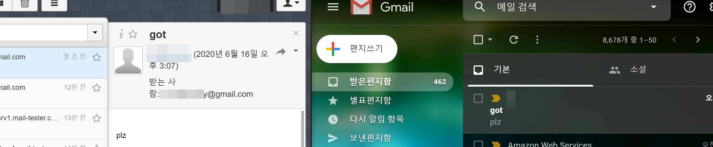

그리고 릴레이서버에서도 로그를 확인할 수 있었다

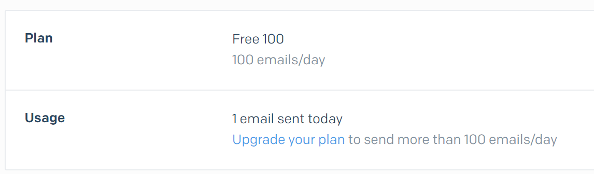

성공적으로 메일 받기, 보내기까지 끝냈다 정말 대단해~~!!!!

### Reverse DNS

남은 하나는 SMPTD 배너다
dns reverse lookup 호스트가 일치하지 않아 여러곳에서 경고를 보내는데 이것도 aws ec2제한이더라고
이거 역시 email send request 답장이 오면 볼 수 있겠다

## 끝?

일단 aws 문제 이후 정말 마지막을 볼 수 있겠지만
그래도 나름 메일 송수신이 되는 메일 서버를 다 만들고 나니 너무 감개무량하다

docker-mailserver 라는 완전 편리한게 있어서 이정도 삽질로 끝난게 다행이지 아니었으면 얼마나 고생했을지 끝은 볼 수 있었는지 상상도 안간다

탈구글에 한발자국 다가간 것 처럼 느껴지지만 그래도 아직은 아니다 정말로 이걸 실사용할 수 있을지는 두고 봐야지

## EC2

메일 답장이 왔다.

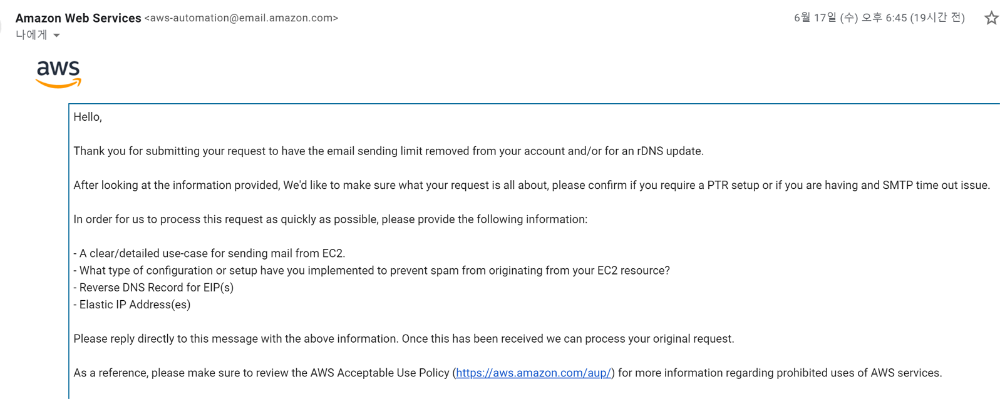

요약하자면

1. 메일을 왜 보내야 하는지 이유가 필요하다.
2. 스팸메일 방지를 위해 어떤 설정을 했는지 알아야 한다.
3. PTR 설정이나 SMTP time out (outboudn 25 port blocked)같은 작업을 정확하게 어떻게 원하는지 알아야 한다.

리퀘스트 폼을 너무 대충 작성해서 그랬나보다. 개인적인 사용 목적으로 메일 서비스를 열었고, 스팸방지를 위해 어떠한 처리를 했으며, Reverse DNS 설정을 위한 IP와 호스트까지 구체적으로 메일로 답장을 하니 2시간만에 다음과 같은 답장이 왔다.

```
Hello,

We have configured the reverse DNS record(s) you requested! Your request was mapped for the following:
...
```

그래서 바로 확인해보니 Reverse DNS도 바로 적용됐고 이전에는 타임아웃만 나던 25포트 SMTP 연결이 이젠 잘 된다. 바로 릴레이 서버 다시 지우고 원래대로 바꾼 다음, 다시 메일 보내기 테스트를 해봤는데 아무 이상없이 잘 되더라. 정말 빠르고 확실한 AWS 대응이 너무 좋았다.

## SPF Error with Auto Forwarding

이젠 정말 문제가 없을거라 생각하고 기존에 메인으로 사용하던 다른 도메인의 이메일 `2@0chan.dev`도 이 서버 메일 계정으로 포워딩하고 메일 alias로 만들어 메일을 보내기도 하게 해두었다. 

지메일로 `2@0chan.dev` 계정으로 메일을 보냈을 때는 정상적으로 메일이 도착했고, 반대로 `2@0chan.dev` 메일로 지메일에 메일을 보내도 정상적으로 도착했다. 하지만 여기서 문제가 하나 생겼다

페이스북 로그인에서 보안 코드를 입력해야 하는데, 저 `2@0chan.dev` 메일로 이메일이 갔다고 하는데 메일이 도착하지 않아서 서버 로그를 보니 다음 에러가 나있다.

```log
Jun 18 05:26:46 mail postfix/smtpd[3784]: Anonymous TLS connection established from mail-wm1-f52.google.com[209.85.128.52]: TLSv1.3 with cipher TLS_AES_256_GCM_SHA384 (256/256 bits) key-exchange X25519 server-signature RSA-PSS (2048 bits) server-digest SHA256
Jun 18 05:26:46 mail policyd-spf[3792]: 550 5.7.23 Message rejected due to: SPF fail - not authorized. Please see http://www.openspf.net/Why?s=mfrom;id=security@facebookmail.com;ip=209.85.128.52;r=<UNKNOWN>
Jun 18 05:26:46 mail postfix/smtpd[3784]: NOQUEUE: reject: RCPT from mail-wm1-f52.google.com[209.85.128.52]: 550 5.7.23 <{mail}>: Recipient address rejected: Message rejected due to: SPF fail - not authorized. Please see http://www.openspf.net/Why?s=mfrom;id=security@facebookmail.com;ip=209.85.128.52;r=<UNKNOWN>; from=<security@facebookmail.com> to=<{mail}> proto=ESMTP helo=<mail-wm1-f52.google.com>
```

에러 메시지는 `550 Message rejected due to: SPF fail - not authorized` 즉 SPF 단계에서 문제가 생겼다는 건데 그렇다면 내 SPF 설정이 잘못됐다면 다른 서버에서 메일을 받는 것도 안되야 할텐데? 해서 보니까 메일을 보내는 주소가 `facebookmail.com`이 아닌 `mail-wm1-f52.google.com`로 되어 있다.

이게 구글 도메인에서 메일 포워딩을 해서 아마 sender 주소가 저렇게 잡히는 거일텐데 이게 내가 rewrite를 하는 서버도 아니고 도대체 어떻게 해야하지?
하지만 뭔가 이상하다. 지메일에서 보내면 원래 주소가 구글이라 허용이 된다는 것도 이상하고 네이버에서 메일을 보내봤는데 정상적으로 메일이 받아졌다.

```log
Jun 18 06:06:53 mail postfix/smtpd[3327]: Anonymous TLS connection established from mail-pl1-f174.google.com[209.85.214.174]: TLSv1.3 with cipher TLS_AES_256_GCM_SHA384 (256/256 bits) key-exchange X25519 server-signature RSA-PSS (2048 bits) server-digest SHA256
Jun 18 06:06:54 mail policyd-spf[3335]: prepend Received-SPF: Softfail (mailfrom) identity=mailfrom; client-ip=209.85.214.174; helo=mail-pl1-f174.google.com; envelope-from={naverid}@naver.com; receiver=<UNKNOWN>
Jun 18 06:06:54 mail postfix/smtpd[3327]: 523409C621D: client=mail-pl1-f174.google.com[209.85.214.174]
Jun 18 06:06:54 mail postsrsd[3342]: srs_forward: <{naverid}@naver.com> rewritten as <SRS0=zTcK=77=naver.com={naverid}@{email}>
Jun 18 06:06:54 mail postfix/cleanup[3341]: 523409C621D: message-id=<f45672d73c882cffbd78cc6f702186@cweb004.nm.nfra.io>
Jun 18 06:06:54 mail opendkim[191]: 523409C621D: mail-pl1-f174.google.com [209.85.214.174] not internal
Jun 18 06:06:54 mail opendkim[191]: 523409C621D: not authenticated
Jun 18 06:06:54 mail opendkim[191]: 523409C621D: DKIM verification successful
```

분명 HELO는 구글주소지만 softfail로 이메일이 받아진다. HELO가 authorize되지 않아도 메일을 받기는 하지만 체크를 해두는 방식이라 메일이 보내지는 것이다.

예를 들어 네이버는 다음처럼 softfail spf를 사용한다.

```DNS
naver.com       text = "v=spf1 [include:...] ~all"
```

구글도 마찬가지로 softfail spf를 사용한다.

```DNS
google.com      text = "v=spf1 include:_spf.google.com ~all"
```

하지만 문제가 되는 페이스북 메일은 fail spf를 사용한다.

```DNS
facebookmail.com        text = "v=spf1 [ip4:...] -all"
```

하지만 이게 구글측에서 메일 포워딩을 하는데 [SRS](https://github.com/tomav/docker-mailserver#srs-sender-rewriting-scheme)을 안해주는 문제라면 내가 어떻게 할 수 있는게 아니지 않나?

아무튼 일단 SPF 보안 수준을 한단계 낮춰서 FAIL까지 메일을 받도록 컨피그 파일을 수정해보자. 이 규칙은 docker-mailserver 에서 밖으로 빠져있지는 않았고, 수동으로 파일을 찾아서 넣어주기로 했다. 파일은 컨테이너의 `/etc/postfix-policyd-spf-python/policyd-spf.conf`에 있었고 이 파일을 수정하기 위해 밖에서 똑같은 파일을 만듦 `HELO_REJECT` 값을 다음처럼 NULL로 바꿔줬다

```config
debugLevel = 1
TestOnly = 1
HELO_reject = Null
Mail_From_reject = Fail
```

그리고 `docker-compose.yml` 파일에서 이 파일을 저 경로로 넣어주게끔 volume을 추가했다

```yml
volumes:
  - ./config-policyd/policyd-spf.conf:/etc/postfix-policyd-spf-python/policyd-spf.conf
```

그렇게 해서 일단 설정이 적용된건지 확인해보고 싶은데 페이스북 로그인 메일 보내기를 좀 많이 했더니 페이스북에서 메일을 보내려면 더 기다려야 한다고 밴을 먹어서.. 일단은 이정도로 정리했다.

## Forward

하지만 당연히 이런 찜찜함으로는 못버티겠더라. 구글 도메인 포워딩을 버리고 그냥 다른 도메인에서 이 메일서버로 alias 계정으로 등록해버리기로 했다.

구글 도메인에서 이메일 포워딩을 지우고, MX 레코드를 이 메일 서버로 연결한 다음 dns적용까지 기다렸다가 메일을 보내보니 성공적으로 메일이 보내졌다. 구글 개싫어

## SIEVE

지메일에서의 필터와 같은 이메일 필터링 및 스크립트를 작성할 수 있는 SIEVE를 추가했다. 서버에서는 단순히 옵션을 키기만 하면 됐고, rainloop 클라이언트에서도 어드민 페이지에서 도메인에 SIEVE configuration 설정만 해주면 바로 적용이 됐다.

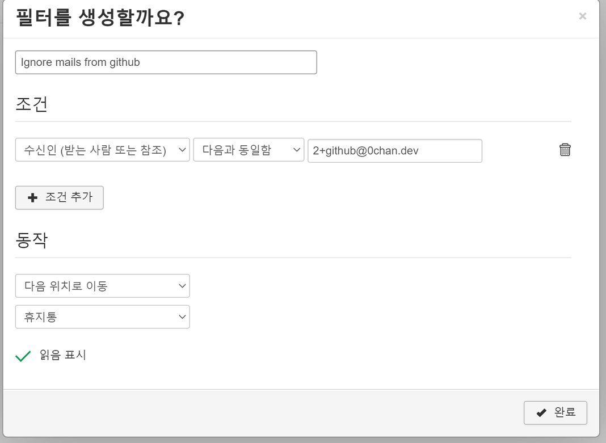

이런식으로 간단하게 필터하여 메일함으로 보내거나 전달, 거부 등의 액션이 지메일과 같이 가능하고 혹은 다음처럼 유저 스크립트를 작성할 수도 있다.

```sieve
require ["fileinto", "reject"];

if size :over 100M {
    reject "I'm sorry, I do not accept mail over 100M in size.";
} else {
    keep();
}
```

\+ 06.23

데스크탑 환경에서는 메일 알림 설정을 해두면 메일창을 열어두지 않으면 조금 느리지만 그래도 알림이 꽤 빨리 오긴 한다. 평균적으로 1분 이내에는 왔고 이게 윈도우 기본 메일 클라이언트에 등록된 gmail보다 빠르다.

하지만 모바일에서 메일 알림을 받으려면 메일 서버를 등록하거나 서드파티 메일 어플리케이션을 사용하거나 해야하는데 그렇게 하기가 귀찮아서 IFTTT와 sieve pipe를 이용해 직접 모바일 메일 알림을 구현하기로 했다.

### ITFFF, sieve-execute

`docker-mailserver`에서 메일 필터링에 사용하는 dovecot의 sieve는 위처럼 메일별 유저 스크립트를 실행하게 해주는데, 여기서 `sieve-extprogram` 이라는 플러그인을 사용하면 외부 프로그램을 호출할 수 있어 스크립트를 작성하고, 메일이 오자마자 즉시 프로그램으로 파이프라이닝이 가능하게 해준다. 그렇다면 IFTTT 웹훅으로 리퀘스트를 날려주는 프로그램에 파라미터를 넘겨 실행만 해주면 모바일로 바로 알림이 오게끔 할 수 있다.

가장 먼저 IFTTT 애플릿 설정을 해준다.

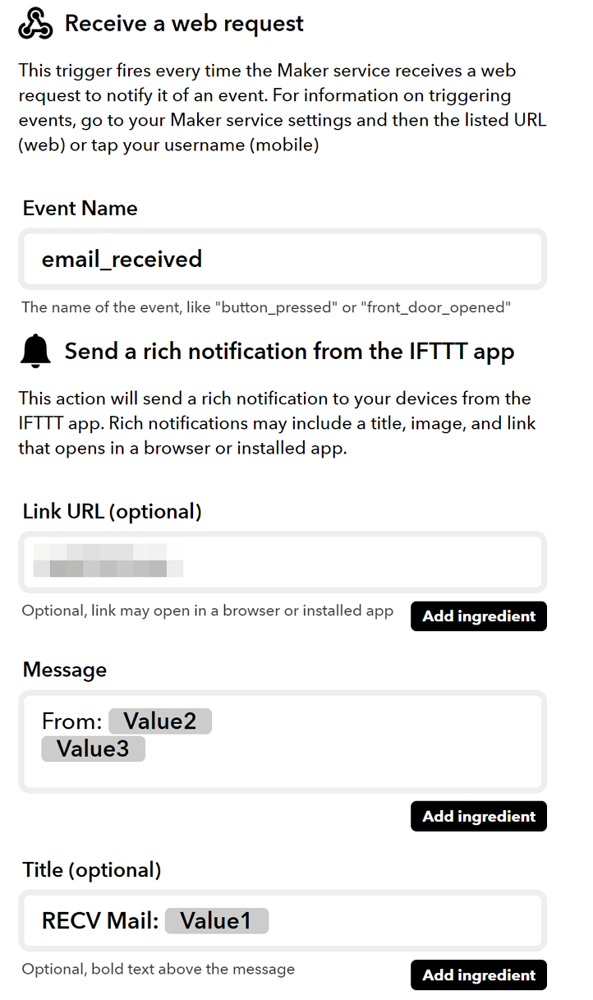

웹훅을 받으면 모바일 알림을 보내는 간단한 애플릿을 만들었고, 위처럼 rich 메시지 포맷을 적당히 해줬다. 받는 사람 `{{Value2}}`, 보내는 사람 `{{Value1}}`, 제목 `{{Value3}}` 으로 세개의 파라미터를 적절히 사용했다.

그리고 웹훅을 보내는 간단한 쉘 스크립트를 작성해준다.

```bash
#!/bin/bash
json_escape () {
    printf '%s' "$1" | python -c 'import json,sys; print(json.dumps(sys.stdin.read()))'
}

EVENT_NAME=""
API_KEY=""
URL="https://maker.ifttt.com/trigger/$EVENT_NAME/with/key/$API_KEY"
P1=$(json_escape "$1")
P2=$(json_escape "$2")
P3=$(json_escape "$3")
PARAMS=$(printf '{"value1":%s,"value2":%s,"value3":%s}' "$P1" "$P2" "$P3")

echo "$PARAMS"

curl \
  -X POST \
  -H "Content-Type: application/json" \
  -d "$PARAMS" \
  $URL

```

이걸 만드는 당시에는 저 `EVENT_NAME`과 `API_KEY`를 고정값으로 박아버렸지만, 상식적으로 이걸 파라미터나 환경변수로 넘기는게 맞다. 하지만 이거는 나 혼자만 쓸거라 상관없지롱

그렇게 이 스크립트를 `config/sieve-pipe/notify.sh` 경로에 저장하면 알아서 도커에서 스크립트를 sieve-pipe에서 실행할 수 있는 경로로 복사해주고 퍼미션을 준다. 그렇다면 남은건 sieve 유저 스크립트를 작성하는 것

문제는 [위키의 sieve 페이지](https://github.com/tomav/docker-mailserver/wiki/Configure-Sieve-filters)의 예제코드에 보이는것처럼 `pipe` 액션을 사용하면 에러가 나서 sieve 스크립트 컴파일 에러가 난다는 것

일단 dovecot의 [공식 sieve-pipe 문서](https://wiki2.dovecot.org/Pigeonhole/Sieve/Plugins/Pipe) 에서는 `pipe` 액션을 물론 `:args` 로 파라미터를 넘길수도 있는데 둘 다 안됐고 여기서 도움을 받아 문서를 천천히 읽어보다 버젼 0.3 이상에서는 pipe가 아닌 extprograms이고, [docker-mailserver sieve 설정](https://github.com/tomav/docker-mailserver/blob/master/target/dovecot/90-sieve.conf)을 보면 이미 플러그인으로 `sieve_extprograms` 요놈을 불러오는걸 알 수 있다. 그렇다면 문제는 extension으로 `vnd.dovecot.execute` 요놈도 같이 불러와야 `execute` 액션으로 파이프, 필터 등의 프로그램 실행이 가능한데 도커 이미지에서는 이걸 바꿀 수 있는 부분이 없어서 추가로 설정 파일을 만들어서 오버라이드 해야 했다.

저 설정파일은 컨테이너에서 `/etc/dovecot/conf.d/##-*.conf` 로 들어간다.
적당한 경로에 설정을 오버라이드할 파일을 만들자. `dovecot/95-sieve-override.conf`

```conf
plugin {
  sieve_extensions = +notify +imapflags +vnd.dovecot.pipe +vnd.dovecot.filter +vnd.dovecot.execute
  sieve_execute_bin_dir = /usr/lib/dovecot/sieve-pipe
}
```

extensions 마지막 `+vnd.dovecot.execute`을 추가해줬고, 아까 sieve-pipe경로에 넣었던 스크립트를 execute에서도 사용가능하게끔 경로를 설정해줬다. 마지막으로 `docker-compose.yml` 파일도 수정해준다.

```yml
volumes:
  # ...
  - ./dovecot/95-sieve-override.conf:/etc/dovecot/conf.d/95-sieve-override.conf
```

그리고 재시작하면 클라이언트에서 다음처럼 아까는 보이지 않았던 `vnd.dovecot.execute` extension이 보이는 것을 알 수 있다

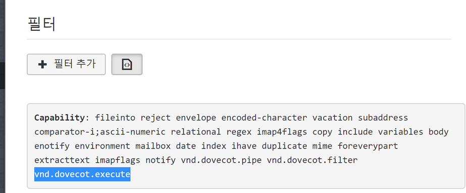

그리고 다음처럼 유저 스크립트를 작성해준다.

```sieve
require ["variables", "copy", "envelope", "vnd.dovecot.execute"];

if envelope :matches "from" "*" { set "from" "${1}"; }
if header :matches "subject" "*" { set "subject" "${1}"; }

execute "notify.sh" ["{myemail}","${from}","${subject}"];
```

그리고 메일을 다른 계정에서 보내서 테스트를 해보면??

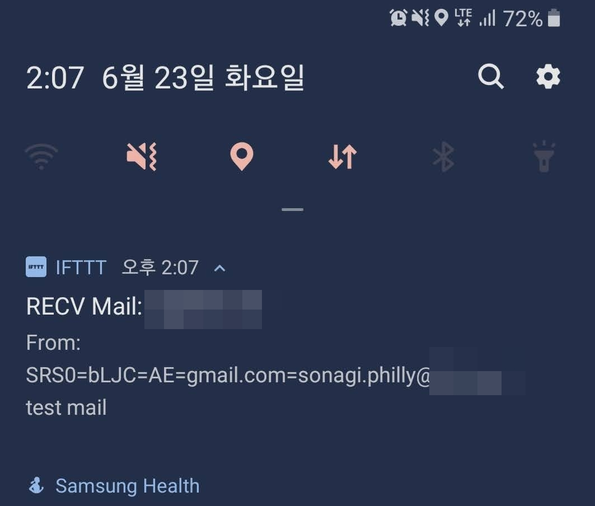

이렇게 메일 알림이 바로 온다!! 하지만 메일을 보내는 주소가 이상하다. 이건 내가 옵션에서 SRS을 켜뒀기 때문이라 SRS을 끄고 재시작하고 다시 테스트를 해보면?

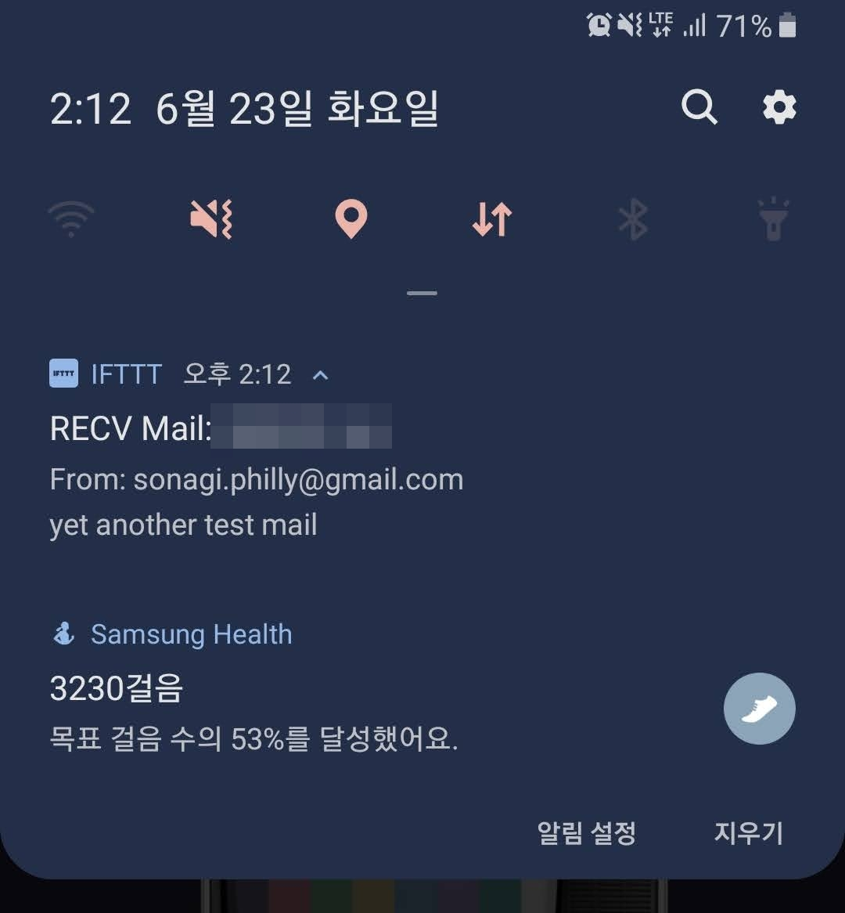

이렇게 정상적으로 메일 주소가 보이고, 메일 제목도 잘 표시된다. 이제 정말 원한이 없다..

## Cloudflare

위 sieve 삽질이 길어졌던 이유중 다른 이유가 있다. 이 메일 서비스 말고 다른 작업에서 DNS api를 사용해 뭔가를 하는 서비스가 필요해 도메인 네임서버를 기존 구글 도메인 DNS에서 Cloudflare로 옮겼다. 이때까지만 해도 이게 나를 그렇게 괴롭힐줄은 몰랐다

가장 먼저는 외부에서 IMTP, SMTP 서버 접근이 아예 안됐다. 처음엔 sieve때문에 터져서 재시작하면 되는가싶더니, 재시작해도 안되고 정말 아주 가끔씩 되다가 다시 안되고를 반복하길래 아예 서버가 죽어버렸나 하고 포기할때쯤 도메인이 아닌 ip주소로 직접 접속하니 되는걸 보고 DNS문제구나 알았다. MX lookup을 돌려보니 IP 로드밸런싱이 되면서 origin ip를 expose 하지 않는다.. 하면서 아무튼 지멋대로 막 바껴서 돌아가는 와중에 [Cloudflare의 메일 셋업 글](https://support.cloudflare.com/hc/en-us/articles/200168876-Email-undeliverable-when-using-Cloudflare)을 보았다. 메일 관련 records를 전부 cloudflare proxy를 지나지 않게 해제하고, 다른 문제때문에 다음처럼 캐쉬, 최적화 등도 껐다. 유료 옵션인줄 알았던 캐싱, 로드밸런싱 등이 자기 멋대로 애매하게 돌아가는게 너무 짜증났다

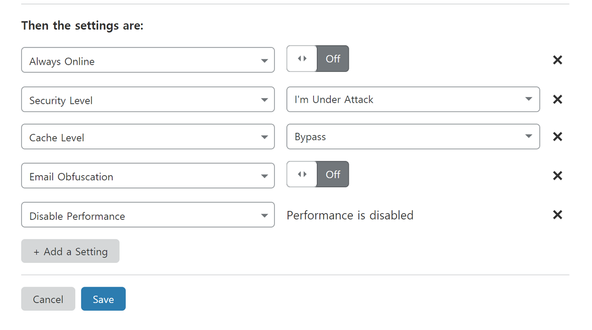

아무튼 MX레코드, origin ip exposing 문제 등도 적당히 눈감아 해결하니 다시 예전처럼 문제없이 접속이 잘 되더라

## 끝

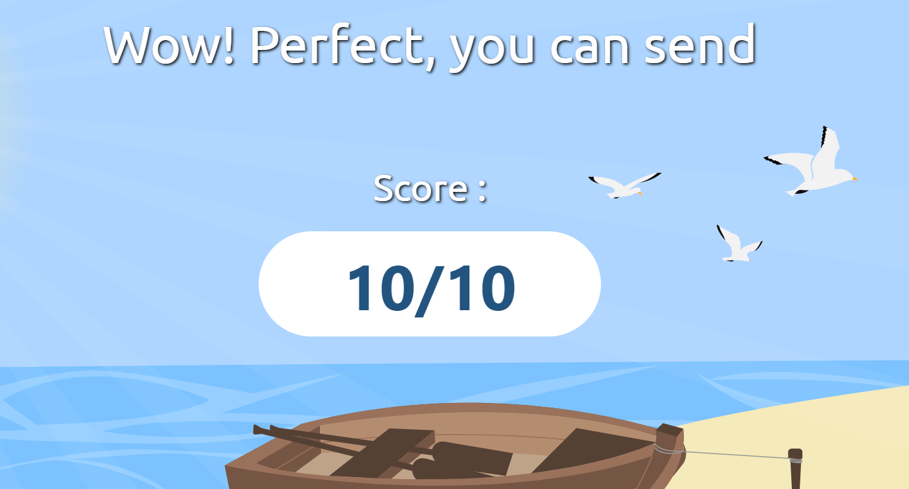

추가로 dmarc설정만 하니까 [mail-tester](https://www.mail-tester.com/)에서 만점을 받았다.

정말 만족스럽고, 앞으로 클라이언트만 내 손에 맞게 만지면 이보다 더 좋을 수는 없을 것 같다.
힘들었고 삽질도 정말 많이했지만 배운 것도 많고 무엇보다 정말 재밌었다.