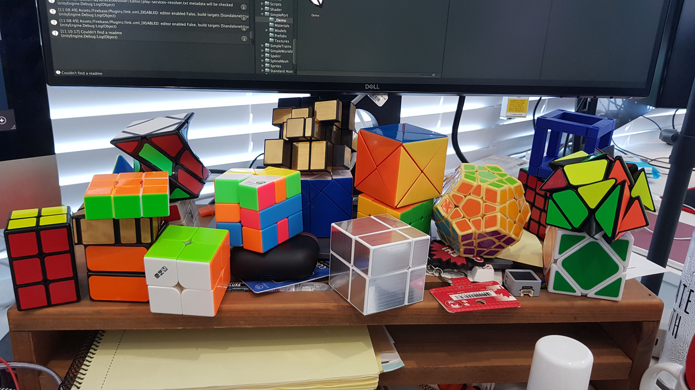

갑자기 현타가 왔다. 21살의 나는 지금 뭘 하고 있지? 내가 대체 뭘 해야 하지? 내가 생각한 21살은 이런 모습이었나??

매년 크리스마스에 회고를 써왔지만 오늘만 예외로, 생각을 정리하자는 의미로 급하게 기록을 정리해본다.

## 상태

2018년 10월, 오민랩을 입사한지 벌써 1년하고도 반이 훌쩍 넘었다. 올해는 절반이 지나갔다는게 실감이 나질 않는다.
회사에서 새로운 게임을 개발하고 있어 뇌를 불태우느라 퇴근하면 힘이 빠져 예전처럼 억지로 공부나 토이 프로젝트를 하기도 힘들고 주말에도 역시 하루종일 누워서 유투브나 보는 생활이 반년째 이어지고 있다.

## 성과

그치만 그래도 내가 뭔가 하지는 않았을까? 생각했던 최악의 모습은 아니지 않을까?

작년에 웹과 서버를 처음 만져본 뒤로 올해의 주제는 웹, 특히 서버가 아닐까 싶다. 작년에 한창 개발했던 .net core 기반 서버 프레임워크 [CreamRoll](https://github.com/20chan/CreamRoll) 에 이어 닷넷으로 여러 시도를 해보고 결국 ASP.NET CORE에 BLAZOR, RAZOR 등의 힙한 기술까지 손을 대보고 말지만 너무 실망하고 typescript 기반 express, react 등의 서버, 웹 프론트 프레임워크를 사용하고 도커와 caddy 등의 컨테이너 기반의 체계화된 프로젝트를 짜보는 등, 정말 **사람다운** 프레임워크로 웹 특히 서버를 공부했다.

회사에서 게임 개발하는거 외에도 유니티로 자그마한 재밌는 것들도 몇가지 만들긴 했다.
유니티 sprite 9-slice 같은 [mesh 27-slice](https://www.youtube.com/watch?v=PgSg7U1UVt0)도 만들었고, [matt stark의 polaroid game](https://youtu.be/ran_yU65Xmg) 영상에 나온 알고리즘도 [직접 만들어보았다](https://www.youtube.com/watch?v=RTmpTyq5qwk). (영상 짱신기하니까 봐주세욤) 그리고 좀 징그럽지만 맘에드는 [procedural IK leg](https://www.youtube.com/watch?v=Ag0G2FutVUY)도 만들어보았다. IK 구현하는데 수식이랑 싸웠던 기억이 아직도 생생하다

외에는 정말 별게 없더라. 블로그에 글도 올렸던 [아희썬](https://github.com/20chan/aheuithon)과 실험적 플젝 .net core runtime method hijacking [hijacs](https://github.com/20chan/hijacs)은 정말 자그마한 플젝들이고, 참신한 시도로는 WFC 알고리즘을 적당히 응용한 영단어 생성 프로그램 [calimolite](https://github.com/20chan/calimolite) 정도가 있겠다.

그리고 최근에 블로그에 글도 올린 [메일 서비스를 연 경험](https://blog.0chan.dev/2020-06-16-Opening-Mail-Server/)정도

외에는 서버 관리나 서버에 여러가지 삽질을 한거, 라즈베리파이와 여러 iot 하드웨어 도전 등이 있지만 자랑할만한 무언가가 나오지는 못했고, 이런 자잘한거 말고는 딱히 없다.

## 취미

그래도 나한테서 프로그래밍을 빼면 아무것도 없는.. 그런 사람까지는 아닐거란 말야
뭔가 가치있는 다른거를 하지 않았을까?

먼저 좋은 게임들을 많이 했다. 최근 너무 맘에 들고 정말정말 좋았던 게임들을 여러 플레이했다. 가장 기억에 남는 나이트 인더 우즈, Assemble with care, mechanika, firewatch, florence 같이 중간에 놓지 못할만큼 좋았던 게임들 말고도 정말 다양한 게임들을 했다.

애니도 봤다. 사실 꽤 많이 봤다. 강철의 연금술사를 넷플릭스에서 정주행했는데 너무 재밌었다. 스티븐 유니버스와 보잭홀스맨, 릭앤모티도 끝나버렸고 이제 다시 뭘 더 봐야 하지 상태에 빠진 듯

중학생 때 취미였던 큐브를 다시 시작했다. 월급도 받겠다, 월급날마다 사고 싶었던 큐브를 잔뜩 사고 하나하나 바닥부터 공식을 계산해 해결한 것도 있고 새롭게 배워가는 것도 있고 할줄 아는 큐브가 하나 둘씩 늘고, 333 스피드 큐빙도 짬짬히 해 최근엔 30초라는 마의 벽도 깨서 정말 재미를 붙이고 있다.

잠깐 피젯스피너같은 장난감도 모았지만 다 부질없더라

여행을 너무너무가고싶지만 지금은 코로나때문에 밖에도 못나가서 무기한 보류중임 ㅠ

## 탈진?

최근 3달의 기억이 전혀 없다. 출근-퇴근-롤-잠 같은 일상이 계속 반복되니까 질릴만도 한데 외에 다른걸 해본 기억이 없다

의욕이 없다는건 아니다. 물론 하고싶은 프로젝트가 꽤 있고 준비도 나름 착실히 많이 했는데 퇴근하고 집에 와서, 그리고 주말에 그 프로젝트를 진행할 힘이 전혀 없다. 작년까지만 해도 이정도는 아니었는데

회사에서 죽도록 일한 것은 아니었다. 하지만 내가 유리멘탈이어서 그런지 플젝에 힘을 너무 쏟고 그게 꽤 지속되니 피로가 너무 쌓여서 이젠 평범한 일상에서도 너무 힘이 빠지고 피로해지더라

뭔가 강한 활력제가 필요하다. 아니면 충분한 휴식이나. 아니면 강제로 날 발로 차서 의자에 앉혀줄 강제 의욕이라도 만들어줄 무언가라도........

사실 어쩌면 내가 너무 욕심이 많고 조바심을 느끼는 거일 수도 있겠다. 최근 1년간 생각보다 꽤 발전했다고 생각하고 이렇게 아무 무리하지 않아도 나는 알아서 성장을 하고 잘하겠지만 당장 내가 만들고 싶은 게 있는데 손도 못대는 내가 상상하는 나의 멋있는 모습과 거리가 멀어지니 그게 너무 아쉬울 뿐이다. 어디까지나 내가 하고 싶은데 의욕이나 피로도때문에 그걸 못한다는 핑계를 대는게 가장 힘든 듯

암튼 나름 내 심각성을 인지하고 싶었고 평소처럼 그냥 넘기긴 싫었다. 글이라도 남겨서 남은 2020년을 지금보다 더 가치있는 반년으로 보내고 싶다.
아마 이게 2020년 봄여름 회고가 아닌 2020년 가을겨울 기약에 가깝다고 생각한다.

이번주 토요일에는 집 에어컨 자동화와 관리툴을 만들어 봐야지
