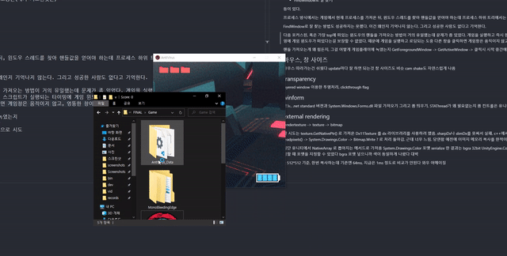
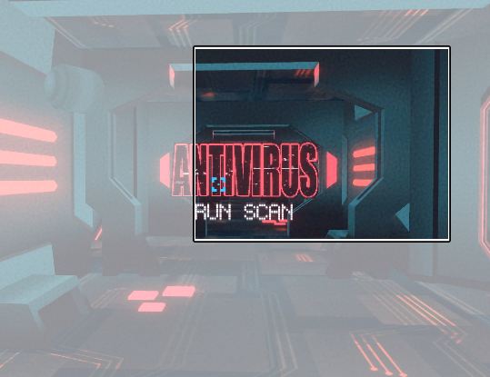
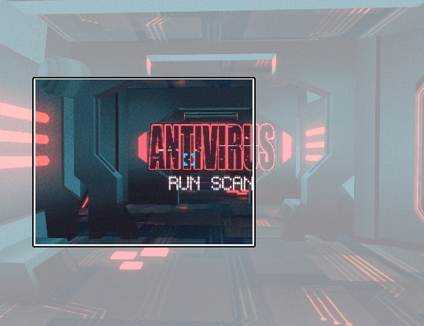
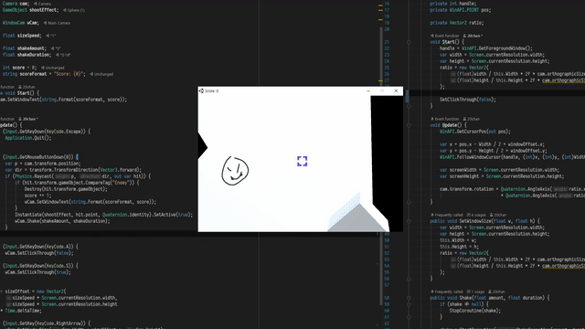
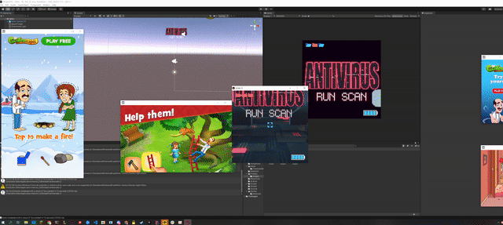
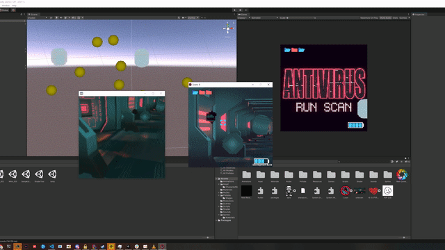

최근 회사 동료분들과 게임잼에서 재밌는 게임을 만들었다. AntiVirus 라고 하는 컴퓨터 안의 바이러스를 잡는 컨셉의 게임이다.

클릭하면 유튜브 영상

[](https://youtu.be/Eh0hOz1sSYc)

[itch.io](https://20chan.itch.io/antivirus)

일반적인 게임과는 다른 플레이 방식으로 재밌는 기술들이 많이 들어갔다.

어쩌면 다른 포스트처럼 완전 기술적인 얘기들보다 게임개발에 관한 이야기도 약간 있을듯

## 앞서

AntiVirus는 게임 창이 마우스를 따라다녀 카메라를 조작하는 방식이다.

처음 WinAPI를 사용한 메타적인 게임에 대한 아이디어는 윈도우 탐색기에서 파일 뷰를 이용한 지뢰찾기를 플레이하는 것으로 시작했는데, 윈도우 사이즈나 위치를 조작한다는 개념에서 어릴적 마우스로 돋보기를 움직여 숨겨진 사물을 찾는 플래시게임이 생각났다.

자연스럽게 에임을 움직여 무엇을 찾는거보다는 에임을 움직여 총을 쏘는게 더 재밌지 않을까? 라는 생각으로 시작됐던 것 같다

## 핸들

윈도우(OS)에서 윈도우에 대한 조작(이동, 사이즈 변경 등)을 위해선 윈도우의 고유 ID인 핸들값을 알아야 한다.

WinForm이나 WPF같은 평범한 윈도우 GUI 어플리케이션이었다면 윈도우의 핸들값을 바로 가져올 수 있게 되어있는데, 유니티는 게임엔진이라 정상적인 방법으로는 핸들값을 가져올 수 없다.

윈도우의 핸들값을 가져오는 방법은 여러가지가 있지만, 보통은(내가 시도한것은)

- 프로세스 ID로부터 가져오기
- 포커스된 윈도우의 핸들 가져오기
- 가장 top에 떠있는 윈도우의 핸들 가져오기
- FindWindow로 잘 찾기

등이 있다.

프로세스 방식에서는 게임에서 현재 프로세스를 가져온 뒤, 윈도우 스레드를 찾아 핸들값을 얻어야 하는데 프로세스 하위 트리에서는 윈도우 핸들을 찾지 못해 실패했다.

FindWindow로 잘 찾는 방법도 성공하지는 못했다. 이건 왜인지 기억나지 않는다. 그리고 성공한 사람도 없다고 기억한다.

다음 포커스된, 혹은 가장 top에 떠있는 윈도우의 핸들을 가져오는 방법이 거의 유일했는데 문제가 좀 있었다. 게임을 실행하고 즉시 현재 포커스된 윈도우의 핸들 값을 가져오는데, 문제는 게임이 실행되고 스크립트가 실행되는 타이밍에 게임 윈도우가 떠있다는걸 보장할 수 없었다.
때문에 게임을 실행하고 로딩되는 도중 다른 창을 클릭하면 게임창은 움직이지 않고, 엉뚱한 창이 게임 화면처럼 움직이는 꽤 심각한 버그를 일으켰다



기술적으로 이를 해결하는것은 답이 안보였다. 하지만 인게임 클릭 이벤트가 발생하면 적어도 그 순간은 포커스된 윈도우가 게임임을 알 수 있어서, 게임을 실행 후 시작하기 버튼을 누르면 그 때 핸들값을 가져와 마우스 트래킹을 시작하게끔 만들었다. 연출적으로도 더 마음에 들어서 완벽한 솔루션이라고 생각된다.

## 마우스, 창 사이즈

게임의 매 프레임마다 윈도우를 마우스의 위치에 움직이게 하는 작업은 그렇게 어렵지 않았다.

```csharp
void Update() {
  WinAPI.GetCursorPos(out var pos);
  WinAPI.MoveWindow(...);
}
```

정도로 구현을 해도 바로 돌아가는 수준이었다. 캠 쉐이크 연출도 적당히 붙여주면 굉장히 자연스럽게 나오더라

하지만 이것도 문제가 없지는 않았다. 전체 이미지의 부분을 윈도우로 본다고 생각하자



위 상황에서 마우스를 왼쪽 아래로 움직여, 이미지의 왼쪽 아래를 본다



이 때 마우스의 움직임과 게임의 렌더링이 완벽하게 일치해야 화면 끊김이 없이 부드럽게 보이는데, 당연히 렌더링 전과 후의 마우스 포인터 위치가 동일하지 않는다. 프로토타이핑에서 orthographic 카메라를 사용했는데 여기서 어쩔 수 없이 화면에서 끊김이 발생했는데 해결방법이 보이질 않았는데, fps로써 perspective가 더 잘 어울리는거 같아서 카메라 타입을 바꾸니 티 안나게 문제가 사라졌다.

## transparency



인게임에서 넣고 싶은 기믹으로써 윈도우의 일부가 투명이 되어 배경이 보이고 clickthrough가 되는 기능을 구현했었다.

윈도우의 [`Layered Window`](https://docs.microsoft.com/en-us/windows/win32/winmsg/window-features#layered-windows)로 금방 돌아가게 만들 수 있었는데, 특정 색이 투명처리 되고 그 불투명도와 clickthrough 여부 등을 설정 할 수 있다.

```csharp
// 검정색이 완전 투명처리
SetLayeredWindowAttributes(handle, 0, 50, 1);
// 윈도우 투명 부분 clickthrough 처리
SetWindowLong(handle,-20,0x80000);
```

예전에 winform에서 비슷한걸 해본 기억이 있어 유니티 게임으로도 될까 싶어서 해봤는데 의외로 잘 돌아가서 신기했다.
아직 게임에 들어가지는 않았고 실용성 차원에서도 의문이지만 간지나니까 잘 살려보고 싶다.

## winform

욕구는 게임 윈도우 말고 새 윈도우 창을 띄워서 게임의 기믹으로 사용하는 것이었다.


> 광고창을 띄워서 게임을 방해하는 애드웨어 보스를 생각하고 있었다. 지금봐도 기가 막힌 연출인듯

가장 먼저 든 생각은 그냥 `new System.Windows.Forms.Form().Show()` 하면 안돼? 였는데 그게 됐다.
바로 참조할 수 있는건 아니었고, 유니티 프로젝트에서 쓰는 모노 버젼과 맞는 `System.Window.Forms.dll` 어셈블리를 찾아 프로젝트에 넣어주니 바로 돌아갔다. 유니티 스크립트 스레드에서 따로 STAThread로 설정 안하고 폼 띄워도 잘 돌아갔는데 인게임에서 윈폼 컨트롤 접근해도 잘 돌아가는거 보고 잘 맞아떨어졌다 싶었음

## external rendering

개발에 투자한 기술의 하이라이트라고 볼 수 있다


> 인게임 카메라를 다른 윈도우에 그대로 렌더링한다

위에서 띄운 윈폼을 또다른 인게임 화면으로 쓰고 싶었다.
처음 생각한 시나리오는 이랬다.

1. 유니티에서 이 게임은 DX11으로 렌더링한다
2. 인게임 카메라 타겟을 RenderTexture로
3. RenderTexture로부터 DX texture 포인터를 가져온다
4. DX를 사용해 GDI+ 혹은 윈폼 DX 컨트롤에 렌더링

3번까지는 잘 돌았다. 유니티의 [`RenderTexture.GetNativeTexturePtr()`](https://docs.unity3d.com/ScriptReference/Texture.GetNativeTexturePtr.html) 메서드는 DX11 기준으로 `*ID3D11Resource`를 반환한다.
문제는 다음인데, 유니티에서 c#으로 DX 라이브러리를 사용하려면 slimDX나 sharpDX같은 래퍼를 사용하거나 api를 잘 뺀 네이티브 바이너리를 만들어 사용해야 한다. sharpDX는 죽었고, slimDX는 유니티에서 쓸 방법이 쉽게는 없고 그렇게까지 무겁게 할 생각도 없어서 마지막 방법으로 하려 했는데 이거마저 굳이 이렇게까지 해야하나 싶었다.

그때 아주 멍청하고 괜찮은 척 하는 생각이 들었다. RenderTexture를 Texture에 blit한 뒤 그걸 윈폼으로 전달하면서 비트맵으로 잘 옮기면 되지 않을까?

안될건 없으니 처음에는 돌아가는걸 보고 싶었다.

```csharp
void OnPostRender() {
  ...
  texture.ReadPixels(new Rect(0, 0, rt.width, rt.height), 0, 0);
  form.Refresh();
}

class ExForm : Form {
  ExForm(Texture2D t) {
    ...
    data = t.GetRawTextureData<Color32>();
  }
  void Refresh() {
    for (var i = 0; i < data.Length; i++) {
        var c = System.Drawing.Color.FromArgb(data[i].a, data[i].r, data[i].g, data[i].b);
        img.SetPixel(i % t.width, t.height - i / t.width - 1, c);
    }
  }
}
```

일단 돌아는 갔다. 하지만 이렇게 만든만큼 책임이 따랐고 128*128의 텍스쳐로 60프레임도 제대로 못뽑는 수준이었다. 최적화가 필요했다

텍스쳐 복사니까 아무래도 메모리를 그대로 복사하는게 제일 정상적이라고 생각을 했고 그럴 방법이 없어보이지는 않았다. 문제는 텍스쳐포맷을 맞추는 거였다
지금 보면 되게 당연한건데 그땐 이걸로 되게 삽질을 많이 했다. 일단 유니티의 Texture2D에서 메모리를 덤프떠서 그대로 c# Bitmap 에 복사했을 때 잘 돌아가야 하기에 같은 텍스쳐포맷을 가지게끔 설정을 해줘야 한다.

많은 삽질을 생략하고 결론만 말하면, 일단 다음 준비가 필요하다

```csharp
// in Unity, initializing
// renderTexture
rt.format = RenderTextureFormat.BGRA32;
rt.graphicsFormat = GraphicsFormat.B8G8R8A8_UNorm;
// texture
t = new Texture2D(rt.width, rt.height, TextureFormat.BGRA32, false);
```

```csharp
// class Form
// ctor
img = new Bitmap(t.width, t.height, PixelFormat.Format32bppArgb);
```

그리고 렌더링은

```csharp
var bd = img.LockBits(new Rectangle(0, 0, img.Width, img.Height), ImageLockMode.ReadWrite, PixelFormat.Format32bppArgb);
var len = bd.Stride * bd.Height;
if (bytes == null) {
    bytes = new byte[len];
}
var src = data.GetUnsafePtr();
// UnsafeUtility.MemCpy(bd.Scan0.ToPointer(), src, bytes.Length);
System.Buffer.MemoryCopy(src, bd.Scan0.ToPointer(), bytes.Length, bytes.Length);
img.UnlockBits(bd);
```

이렇게 메모리를 그대로 덮어씌우기만 하면 된다. 프로파일을 찍어보면 대충

```
128*128
기존 루프: 4ms
메모리 복사: 0ms

512*512
기존 루프: 65ms
메모리 복사: 0ms
```

이미지 처리는 더이상 신경쓸 문제가 없어 보이고 대신 무식하게 비트맵을 사용하는거니 winform refresh이 큰 병목이 되는데 적당히 더블버퍼링 설정해주니 그렇게 신경쓰일정도는 아닌거 같다. 적당히 싸고 머리아프지 않게 잘 만들었다고 생각

## 정리

재밌는 아이디어에서 출발해 짧은 시간동안 하고싶은걸 왕창 집어넣었는데 유니티 게임에서 이런걸 할 수 있을까? 에서 대부분 이런걸 할 수 있구나 정도로 넘어가는 순간이 짜릿했던 것 같다. 찾아보면 자료도 거의 없고 내가 최초다 싶은 경우가 있었는데.. 만약 이 블로그가 관련 주제에서 유일하다 하는 일이 올까?
