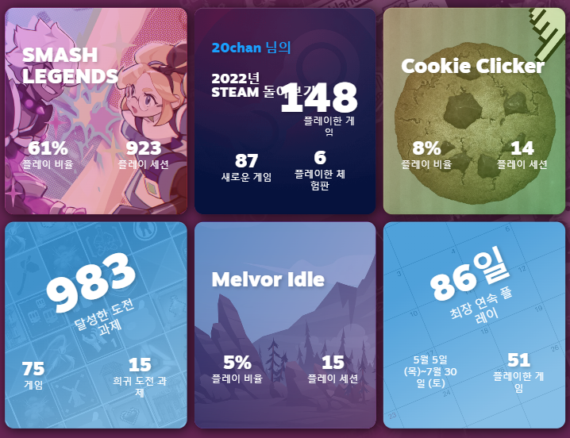

어느새 2022년 12월 25일 크리스마스..가 지나버리고 28일이 되었다. 회고를 쓴다는걸 깜빡해버려 5년의 전통을 깨고 늦은 회고를 작성해본다.

- [2017 크리스마스 회고](/2017-12-25-Look-Back-At-2017/)
- [2018 크리스마스 회고](/2018-12-25-Look-Back-At-2018/)
- [2019 크리스마스 회고](/2019-12-25-Look-Back-At-2019/)
- [2020 크리스마스 회고](/2020-12-25-Look-Back-At-2020/)
- [2021 크리스마스 회고](/2021-12-25-Look-Back-At-2021/)

## 게임

이 글로 내가 특정되거나 검색되는걸 방지하기 위해 자세한 이름은 생략하자.

올해는 sl에 인생을 담궜다. 현재 스팀에서 대략 1400시간을 달성했고 매일 퇴근 후 sl 후 잠들기를 반복했다. 개인적으로 개발에 돌릴 시간이 없었고, 게임을 플레이하다 외부적으로 필요한 것을 개발하기 일쑤였다. 회사에서 시작해 대부분 개인 시간에 개발하고 있는 [전적/통계 사이트](https://smashlegends.gg/) 라던가 대회 때 사용할 challonge 보다 더 특화된 프로젝트라던지 비슷한 것들을 게임하다 개발하곤 했다.

외에도 다양한 게임을 했다. 플스5도 샀고, 갓오브워 라그나로크도 플레이 중이다. 너무 많은 게임을 플레이해 모든 목록을 적을 수 없어 재밌게 했던 게임들만 적어본다. 내 가슴을 울렸던 게임은 볼드처리를 한다.

- Batman: Arkham Knight
- Vampire Survivor
- Tekken 7
- **Half-Life: Alyx**
- Project Zomboid
- ELDEN RING
- **God of War**
- **Cookie Clicker**
- Unpacking
- Disco Elysium
- **The Thrill of the Fight**
- **Peglin**
- Stacklands
- Shotgun King
- **산나비**
- **Stray** - 최고의 게임
- Cult of the Lamb
- There Is No Game
- Dome Keeper
- BPM - [첫 스테이지 노래](https://www.youtube.com/watch?v=IbWpQZsFIik)가 정말 끝내준다. 근데 그것만 끝내준다.
- **The Past Within**
- **Core Keeper**
- **For The King**
- **A Way Out**
- TOEM
- Potion Craft
- DEATH STRANDING

## 프로젝트

올해는 게임만 했기에 따로 개인적으로 만들어본 장난감이 얼마 없다. 하지만 혼자서 주도적으로 개발해서 끝을 본 프로젝트가 드디어 나왔다. 처음에는 회사에서 심심해서 시작했지만, 이후 개인 시간에 꾸준히 개선하여 만든 위에서 언급한 [sl 통계/전적 사이트](https://smashlegends.gg)이다. clickhouse-metabase 에서나 가능한 n중 join에 괴랄한 서브쿼리들을 작성하고 (대체 array join은 뭐고 any~partition by는 뭐지 싶었음) 겉으로 꽤 그럴싸하게 보이는 통계 사이트이다. 처음에는 내부의 니즈였지만 결국에는 나와 유저들의 니즈로 꾸준히 개발했고 지금은 꽤나 규모가 커진 만족스러운 내새끼가 되었다.
next.js는 역시 이런거나 만들 때 꽤나 유용했고, knex은 typeorm보다 훨씬 매력있었고 웹 프론트는 평생 못할 것 같았다.

외에는 정말 없다. 올해 초에 [.net 커스텀 JIT 컴파일러](https://blog.0chan.dev/2022-03-06-Dot-Net-Core-Custom-JIT/) 라는 글을 쓰기는 했지만 이게 올해 한거였는지 기억이 안났다.

## 회사

게임 서버와 기술들을 혼자 막게 되었다. 피쳐 구현부터 배포, 유지보수, 모니터링 (게임하다가 서버 상태가 안좋아지면 사라지는 사람이 되었다) 인프라 및 기술적 무언가들을 작아진 팀 규모에서 모두 책임지게 되었다. 사실 책임지게 되었다고 하기엔 거창하지만 팀의 규모가 작아짐에 따라 시니어분들이 손을 떼셨고(보고있냐 아저씨? 보고있으면 술사줘요) 나 혼자 남아 큰 짐을 떠앉게 된 셈인데..

굉장히 바빠졌고 할 일이 너무 폭넓게 많아졌다. 컨텍스트 스위칭이 굉장히 자주 일어나고 일 큐는 쌓이며 신경쓰지 않으면 관리가 안되기 시작하는걸 신경써서 관리도 해야했다. 서버-매칭-데디 사이에서 1년정도 있던 고질적인 버그가 있었는데, **내** 게임 경험을 너무 해쳐 한달정도 계속해서 고치려고 노력했었다. 사실 시니어분들이 신경도 안쓰고 반 포기한 이슈긴 했지만 내가 그것을 해결하지 못하는 사람주제에 혼자 서버 팀 방어를 할 수 있을까? 라는 생각에 꽤 힘들었었다. 그 생각을 좀 자주 할 때 쯤 의심가는 부분을 고쳤더니 문제가 해결되었고, 신기하게 이후로 자신감이 생긴지 뭔지 몰라도 많은 문제들을 부담감없이 해결할 수 있었던 것 같다.

## 올해는

솔직히 말해서 꽤나 힘든 1년을 보냈다. 머리 아픈 연애 관계도 있었고, 몸과 정신 상태도 그닥 좋았던 적이 없어 하루를 좀비처럼 보낸적이 꽤 많았다. 지금도 딱히 머리가 맑지는 않지만 친구들 덕분에 상태는 충분히 좋아졌고 적어도 집에서 뭔가를 할 힘이 나는 듯 하다.

작년에 눈에 띄는 움직임을 보여준다고 했었다. 하지만 이걸 1년 더 뒤로 미룰게 아니라 내가 진짜 삘이 꽂힐 때를 기다리려고 한다. 언젠가 내가 정말 꽂혀서 어마무시한 무언가를 해낼 것이라 믿는다. 조바심을 갖지 않고 나를 믿어보기로 했다. 정말 불안한 1년을 무사히(?) 보냈듯이

## 2022년은..

구체적인 목표는 없다. 하지만 제발 정신만큼은 멀쩡했으면 좋겠고 빌빌대지 않았으면 좋겠다. 또 약간의 욕심으로 컴파일러에 다시 열정을 담구고 싶다.
