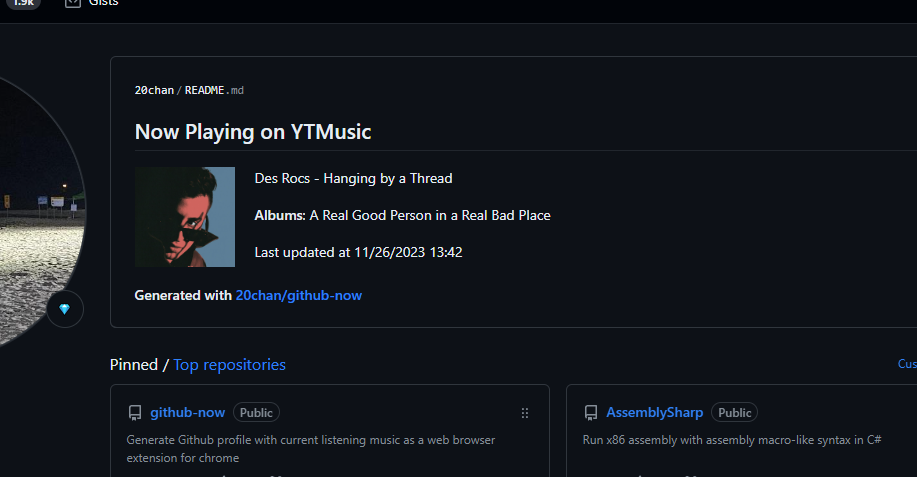
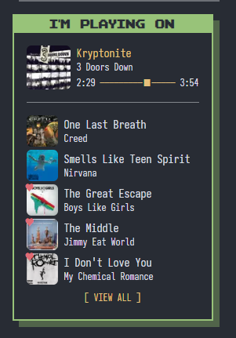
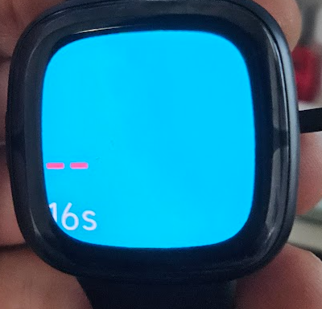
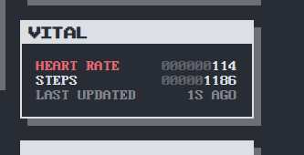

최근 퇴사 이후 새롭게 홈페이지 겸 블로그를 만들면서 그동안 해보고 싶었던 여러 기능들을 만들어 보았다.
그 중 가장 하고 싶었고, 지금껏 시도도 여러번 해보았지만 이제서야 성공한 것들을 소개하고자 한다.

## 노래

내가 어떤 노래를 듣고 있는지 실시간으로 공유하고자 하는 생각은 꽤 오래전부터 있었다.
[github-now](https://github.com/20chan/github-now)는 약 4년 전에 개발한 github 프로필에 현재 듣고 있는 노래를 표시해주는 프로젝트였다.
크롬 확장프로그램으로 브라우저에서 재생중인 노래를 가져와 github 프로필 readme를 알아서 업데이트해주는 방식이다.
현 시점 스타 99개로 눈길도 끌었었고, 꽤 만족스럽고 여전히 사용중이지만 개인적으로 항상 켜두진 않고 엄청 꽂힌 노래를 가끔씩 업데이트하는 용도로 사용하고 있다.

실시간으로 어떤 노래를 듣고 있는지, 그리고 음악 재생 기록을 확인할 수 있는 위젯을 홈페이지에 꼭 만들고 싶다 생각한 것도 당연하다 싶었다.
github-now 코드 기반으로 개인 서버에 노래를 업데이트하는 시스템을 만들었고 홈페이지에 이쁘게 달았다.

개발은 크게 어렵지 않았다. 원하는 감성이 맞춰 디자인하는게 어려웠을 뿐

## 심박수

나는 안정시 심박수 110을 도달한 멋진 동성빈맥 환자이다.
일상생활에서도 심장이 갑자기 크게 뛰어 집중을 방해하거나 심장 박동때문에 잠을 못 이루는 경우가 많았는데...
가끔 갑자기 심장때문에 무슨 일이 생기면 어떡하지? 라는 생각으로 심박수 측정을 위한 스마트워치에 관심이 많았고, 갤럭시 워치를 구매해 사용했지만 아쉽게도 심박수 관련 기능이나 활용도가 적어서 잘 사용하지 않았다.

그렇게 잊혀지다가 최근에 fitbit 워치 api를 활용해서 자신의 헬스 대시보드를 grafana로 만든 [레딧 포스트](https://www.reddit.com/r/selfhosted/comments/15ao3my/i_made_a_onepage_comprehensive_dashboard_using/)를 보고 바로 조사 후 구매해버렸다.

fitbit 워치가 은근 기기 종류가 많은데 기능 비교가 잘 안되서 가장 최근에 나오고 제일 비싼 fitbit sense 2를 구매했는데 나중에 살짝 후회하게 된다.

아무튼 내가 원했던 것은 두가지였다:
- 서버에 실시간 심박수 데이터 저장, 활용 가능하게
- 심박수, 걸음 수, 수면 패턴 등의 데이터를 grafana 대시보드로 확인

그렇게 개같은 삽질이 시작되었다.

### fitbit

fitbit 워치는 web api로 지난 데이터 요약을 가져올 수 있고, 간단하게 워치 앱을 개발하고 휴대폰과 통신할 수 있는 device-companion sdk를 지원한다.
앱 개발 느낌이 아니라 간단한 html/js 정도로 커맨드 하나로 빌드하고 로그인된 기기에 앱을 바로 배포해서 워치와 휴대폰에서 작동을 테스트할 수 있어 개발 경험이 엄청 좋았다.
물론 비주류 플랫폼에, 공식 문서는 구글에서 인수한 후 관리해서 그나마 깔끔했지만 은근 찾기 힘든 정보와 포럼을 뒤져야 겨우 찾을 수 있는 인터널 정보들이 많아 삽질을 많이 했지만, 한나절 정도 걸려 한바퀴를 돌릴 수 있는 프로토타입이 나와 나쁘지 않은 편이었다.

가장 먼저 시도한 것은 웹 api였다. 문서가 잘 되어 있어 쉬웠지만, 아쉽게 웹 api는 실시간 데이터를 받을 수 없이 지난 데이터 요약을 time series로만 가져올 수 있었고, 웹훅도 심박수를 지원하지 않았다. 남은건 좀 피하고 싶었던 워치 앱 개발뿐이었다.

워치 앱 개발은... 정말 순탄하지 않았다. 위 가장 비싼 모델 Sense 2를 사고 후회했다 했는데, 바로 Sense 2는 공식 SDK 릴리즈가 되지 않았고 그럴 낌새도 없었다.
포럼에 가서 뒤져보면 `Sense 2 SDK 언제 나와요?` `개발자가 진짜 곧 나온댔는디? (1년전)` 같은 대화밖에 없었다.

환불하고 이전 모델 사라는 답변을 보고 환불각을 재던 중 [unofficial approach for Versa 4 and Sense 2](https://github.com/cmengler/fitbit-app-versa4) 리포를 보고, 설마설마하면서 적당히 따라해보았다.
먼저 sdk `7.2.0-pre` 버젼을 사용하고, sdk 리포에서 [내 모델의 기기 이름](https://github.com/Fitbit/fitbit-sdk-toolchain/blob/7.2.0-pre.0/src/buildTargets.ts#L23)을 찾아낸 다음, 빌드해보려는데 어라? `npx fitbit` 으로 빌드하라는데 `fitbit` 패키지가 설치가 안된다?

설치 에러를 보니 디펜던시 리포 하나가 github에서 사라졌는데, 8년전 아카이브된 공식 sdk가 이게 맞나?? 해서 공식 문서를 뒤져보니 패키지 이름이 다른거더라. 공식 [Getting Started](https://dev.fitbit.com/getting-started/) 문서에서는 `npx create-fitbit-app` 으로 프로젝트 생성을 알려주는데, 이렇게 시작을 안해서 아예 의심을 못했었다.
이걸 github에서 공식 fitbit org에 있는 `fitbit-sdk-toolchain` 리포가 어디에 쓰이는지 검색하다 [공식 문서의 cli 문서](https://dev.fitbit.com/build/guides/command-line-interface/#updating-existing-projects)에서 알아차렸다. 아유 멍청한 나와 개같은 공식 문서

아무튼... 어찌어찌 저렇게 하니까 바로 빌드가 잘 되더라? 근데 그 다음도 살짝 뇌가 아팠다.
Sense 2는 국내에서만 그런지 모르겠는데 wifi를 사용할 수 없게 비활성화되어 있는데 앱 설치를 위해선 와이파이로 인터넷에 연결해 개발자 브릿지를 키라고 나와있다.
뭐지??????? 싶어서 개발자 브릿지의 usb 디버깅 옵션이라도 써보기 위해 usb 연결을 해보려 했는데 요놈의 워치는 포트같은건 없이 무선 충전만 지원을 하는 것이었다.
30분 정도의 "Sense 2 usb 케이블" 구매를 위한 서치를 하다 무선 충전기의 usb를 pc에 연결하면 설마 usb 디버깅이 활성화되나 싶어 확인해봤는데... 잘 되더라.
정확히, "잘 되지"는 않았다. 연결 전과 연결 후 에러 메시지가 다르다는 것으로 연결은 이렇게 하는 거구나, 라는 것을 깨닫기만 했을 뿐.

나는 리눅스 서버에서 개발하고 있었는데 fitbit sdk에서 리눅스 개발 자체를 지원하지 않기도 하고, node-usb가 리눅스 환경에서 터지는걸 굳이 고치고 싶지 않아 윈도우로 개발을 옮기고 다시 해보니까 그제서야 빌드 후 앱 설치에 성공했다. 우하하하하

이후는 순?탄했다. 심박수 센서를 사용해 심박수를 매 초 가져오는 건 쉬웠다. 워치는 네트워크 사용이 안되니 워치에서 폰으로 웹소켓을 사용해 데이터를 보내고, 폰에서 서버로 데이터를 보내는 것도 바로바로 됐다. 물론 워치가 계속해서 화면이 꺼지고 그러면 앱이 종료되는 문제가 있는데, 화면을 계속 켜두게 해도 배터리가 원래 오래가 크게 부담가지 않았다.

이 과정에서도 열받는게 몇가지 있었다. 먼저 AOD는 "제품의 안정성"을 위해 개발 중에는 사용할 수 없는 기능인 게 꽤 열받았고, 두번째로 강제로 워치를 계속 켜둬도 팔의 위치에 따라 워치가 꺼지는건 어떻게 할 수 없다는게 가장 열받았다.
그래서 지금은 책상에 앉아 있는 경우에는 워치가 위로 올라가 거의 항시 켜져 있지만 일상 생활중에는 종종 꺼진다. 그러면 트래킹도 멈춘다. 백그라운드 런이 뭔지 모르나?

### 아무튼

아무튼? 됐다. 실시간으로 내 심박수를 약 1초의 지연으로 볼 수 있게 홈페이지에 달아놨다.

그리고 이걸 만들 때 계속해서 재밌어 보인다 생각한건 게임할 때 사람들이 내 심박수를 보는 거였는데, 방송에 오버레이로 띄워서 보여주니 잘 작동하고 게임과 내 심박수의 상관관계도 볼 수 있었다. 잘할때는 그냥 무난무난하다 못할수록 심박수가 서서히 120까지 올라가는걸 보니 짜릿하더라. [유튜브](https://www.youtube.com/watch?v=h07b0Hm76xk)에 짤막하게 클립을 올려놨다.

## 이후

위 기능들이 구현된 홈페이지는 여전히 아이디어가 떠오를때마다 만들고 있다. [0ch.me](https://0ch.me)에서 볼 수 있다.

grafana에 health dashboard는 이미 만들어진 것도 있고, 금방 만들 듯 하다. 굳이 만들고 나서 추가하진 않을 것 같다.

내 건강 데이터를 활용해서 좀 더 재밌고 유용한 것도 만들고 싶다. 당장은 딱히 아이디어가 없지만 추후 생각나면 해봐야지